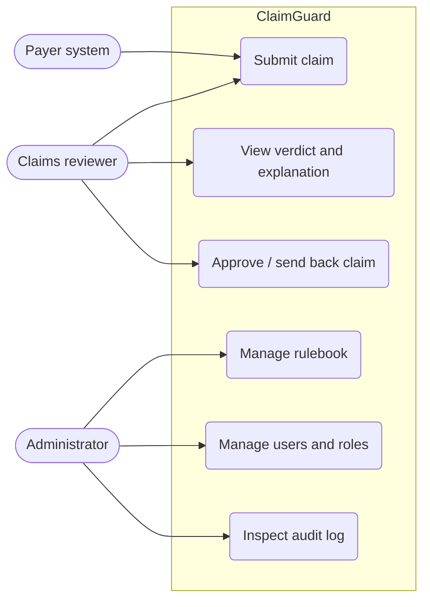
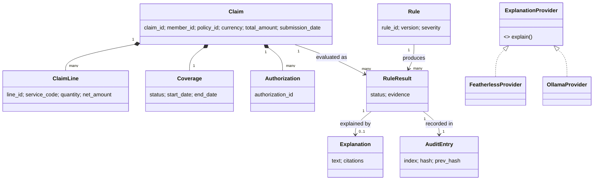
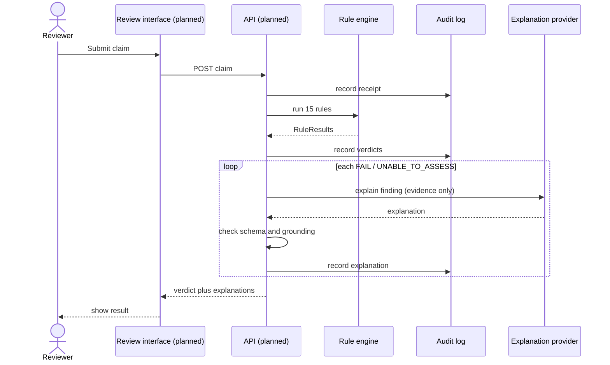
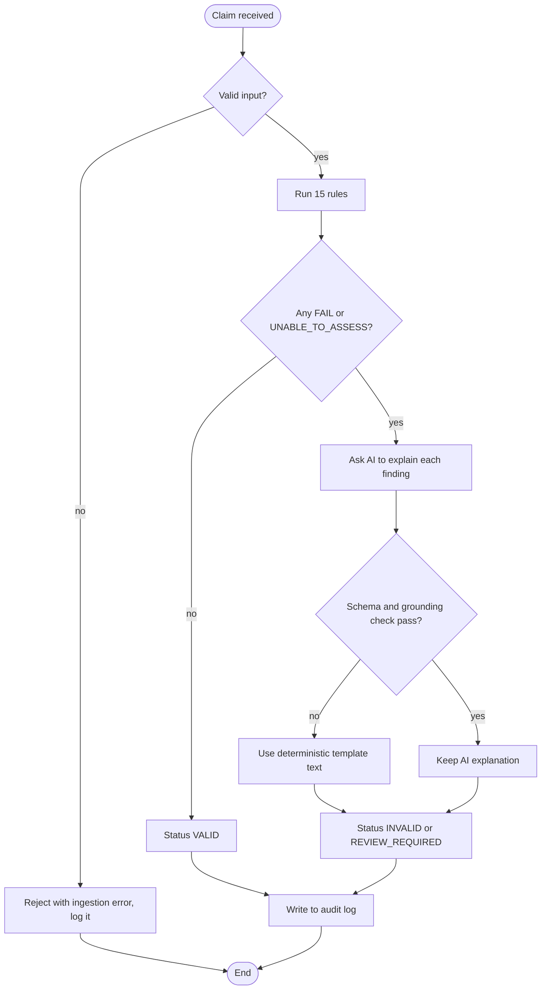
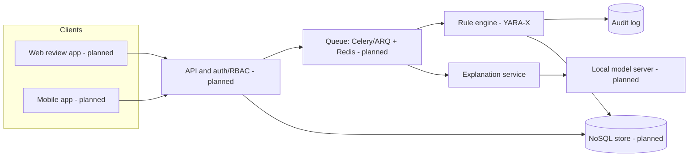
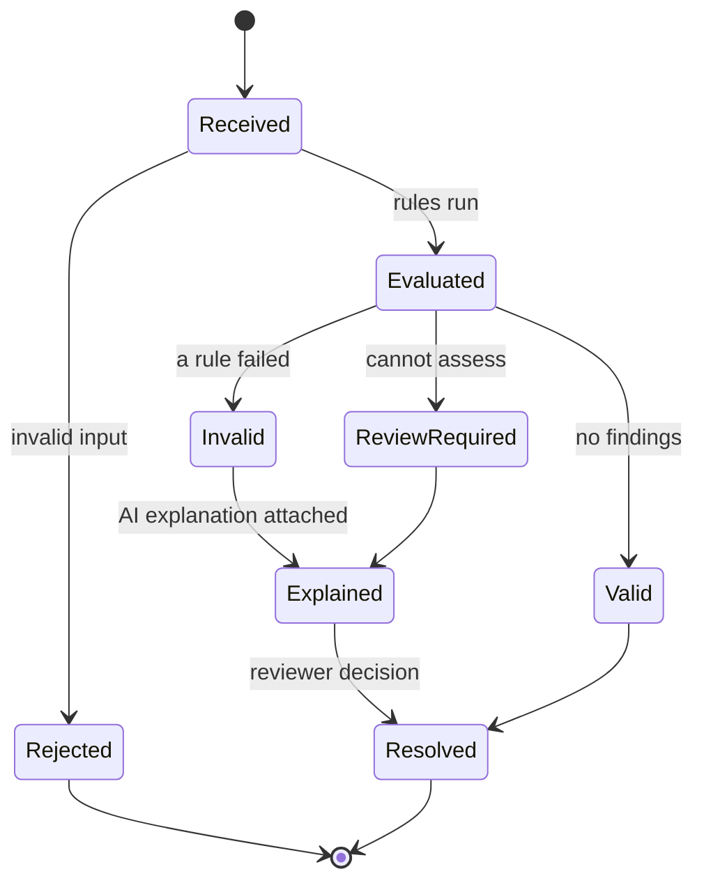
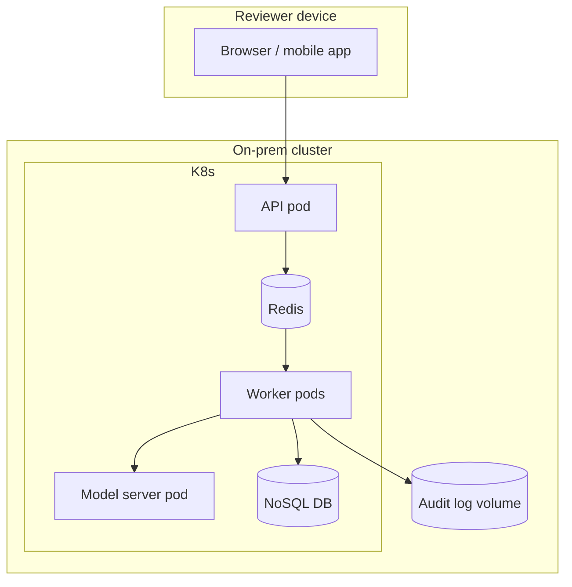

# BLUEPRINT: ClaimGuard as an information system

What we deliver, what makes it good, who it is for, how it gets built, how we test it, and what it looks like in UML. The deliverables checklist (section 0) maps every submission item to its file.

**Companion document.** [SPECIFICATION.md](SPECIFICATION.md) is the requirements specification (cahier des charges) and UML model of the same system as built in Phase 2: numbered requirements, business rules, a full specification of all 20 use cases (main scenario, secondary scenarios, extensions, failures), a failure catalogue and 14 UML diagrams. Use this file for the information-system view (quality, canvas, realisation steps) and SPECIFICATION.md for exactly what the system does.

Status legend: **Done** = built and tested in this repo. **Partial** = some evidence, gaps stated. **Planned** = mentor-requested or designed, not built.
Anything about customers or the market is a **hypothesis** until someone interviews real users. None of it is measured data.

---

## 0. Deliverables (challenge submission checklist, `docs/01_Challenge_Brief.md`)

| Deliverable | Where | Status |
|---|---|---|
| Reproducible repository: README, dependencies, config example, launch commands | `README.md`, `requirements.txt`, `.env.example`, `docs/06` | Done |
| Architecture and data-flow diagram with trust boundaries and tool permissions | `docs/22_Architecture_and_Data_Flow.md`; UML in section 5 below | Done; UML extends it |
| Working review interface | `src/make_review.py` (offline page with filters, original values, unresolved counts, four decision types) | Done as static page; web and mobile app are the next phase |
| Recorded demo | `scripts/demo.py`, `docs/23_Demo_Video_Kit.md` | Being filmed |
| Concise pitch presentation | Business canvas (section 2) is its backbone | In progress |
| Technical report: implementation, decisions, tests, limitations | `SPECS.md`, `docs/27_Decisions_Proofs_and_Defense.md` | Done; doc 27 is being backed by experiments |
| Evaluation report: split, rule metrics, false positives/negatives, AI ablations | `docs/17_Evaluation_Report.md`, `docs/21_Experiments.md`, `SPECS.md` section 11 | Done for rules; the AI-vs-template ablation is the next experiment to add |
| Privacy/security note and auditable sample run | `docs/10`, `docs/20`, `outputs/audit_demo`, `outputs/audit_dev` | Done |
| Contribution log: team roles and AI-tool use | `docs/18_Contribution_Log.md` | Done |

The brief says visual polish alone is insufficient: a reviewer must be able to verify findings and see where the system abstains. Sections 1 to 5 below feed the pitch; doc 27 feeds the technical report.

---

## 1. Software quality characteristics: what each means for ClaimGuard, and where we are

| Characteristic | What it means here | Status | Evidence / gap |
|---|---|---|---|
| **Utility** (does the job) | Pre-validates a healthcare claim against 15 payer rules and explains each failure | Done | Rule engine matches the answer key on the development split (CI `rules-accuracy` job) |
| **Usability** | A reviewer can read verdicts and explanations without knowing the rules | Partial | CLI and demo script only; the review interface (web, then mobile) is Planned |
| **Reliability / fiability** | Same input gives the same verdict; failures never corrupt results; the audit trail cannot be silently altered | Done | Deterministic rules; hash-chained audit log; the concurrency race was found, fixed and verified 10/10 |
| **Security** | The AI cannot override a verdict; injected text in a claim cannot change a status | Done (app) / Planned (auth) | `docs/20_Security_Audit.md`, Bandit and OWASP suites in CI. Authentication and RBAC are not implemented |
| **Interoperability** | Accepts standard claim formats and exposes results to other systems | Partial | JSONL plus a normalized schema, FHIR comparison exists (`outputs/fhir_vs_normalized.json`). No API server yet |
| **Performance** | Reviewer gets a verdict fast; the system scales to many claims | Partial | Rules run in about 2 s for the demo; AI explanation adds seconds per finding. No queue or load test yet (Celery/ARQ and Redis are Planned) |
| **Portability** | Runs on Windows, Linux, several Python versions, and fully on-prem | Partial | CI runs on 3 Python versions. The AI explanation currently needs a hosted API; local model serving is Planned (mentor point 8) |
| **Maintainability** | Rules can be changed without touching engine code; changes are safe | Done | Rules are YARA-X text files, 489 tests, CI, CODEOWNERS, PR template |
| **Reusability** | Rule engine, audit log and explanation guard are usable in another payer or domain | Partial | Modules are separate; no packaging or documented extension guide |
| **Facility (ease of setup and use)** | A newcomer can install, run and see a result in minutes | Partial | README and `scripts/demo.py` (8 scenes, offline). No installer or container image |

**Realistic scope for this period:** finish Usability, Interoperability and Performance minimums (a thin API plus one review screen plus a queue stub). Treat Portability and Reusability as documented design and leave full implementation for later.

### Lifecycle steps we follow
1. Requirements (challenge brief, mentor meetings) 2. Design (architecture doc 22, this document) 3. Build 4. Verify (tests, CI, stress pass, security audit) 5. Deliver (demo, pitch) 6. Maintain.
Steps 1, 2 (in part), 3 (Phase 1) and 4 (Phase 1) are complete. Steps 5 and 6 are open.

---

## 2. Business Model Canvas (working hypotheses)

**Problem.** A payer or claims-processing team receives claims that break payer rules: wrong currency, expired coverage, submission window missed, missing authorization. Reviewers check these by hand. Checking is slow and inconsistent, and an AI that judges claims on its own is hard to trust and hard to audit.

**What ClaimGuard solves.** It separates the two jobs. Fixed rules decide pass or fail, deterministically and testably. An AI only *explains* a verdict in plain language, and its answer is checked against the evidence. Every step is written to a tamper-evident log. The reviewer gets consistent, explainable, auditable pre-validation instead of a black box.

| Block | Content (hypothesis unless marked) |
|---|---|
| Customer segments | Insurers/payers' claims reviewers; third-party administrators; provider billing teams who want to pre-check before submitting |
| Value proposition | Consistent rule checks; explanations tied to evidence; audit trail; runs on-prem (this matches the mentor's on-prem point) |
| Channels | Pilot with one payer; web review app; API for their existing claim system |
| Customer relationships | Pilot support, rule-authoring help, versioned rulebook updates |
| Revenue streams | Per-claim or per-seat subscription; paid rulebook customization. Pricing is **not researched** |
| Key resources | Rulebook and engine, audit log, test suite, domain knowledge of payer rules |
| Key activities | Rule authoring and validation, model evaluation, security review, reviewer UX |
| Key partners | Payers willing to pilot; model provider or local-serving stack; the mentor and challenge organisers |
| Cost structure | Developer time; model inference (hosted API or GPU for on-prem); compliance and security review |

### Desk research behind the canvas (30 September 2026)

What web research supports. These are web summaries, several from vendor or billing-industry blogs, not primary datasets, and the US figures describe the US market; none of it is our own measurement. Check a number against its original report before putting it on a slide.

| Question | What the sources say | Source |
|---|---|---|
| Is the problem real? | The all-payer initial claim denial rate was reported as 11.8% in 2024, up from 10.2% in 2020, with about 12.6% estimated for 2026. Administrative errors are cited as 30% to 40% of denials. | [Medical Billing Denial Statistics 2026](https://www.gomedicalbilling.com/medical-billing-denial-statistics-2026), [Claim Denial Statistics 2026](https://nirmitee.io/blog/healthcare-denial-trends-2026-data-root-causes-ai-playbook/) |
| What does an error cost? | Reworking a denied claim is cited at $25 to $181, about $118 on average. | [Claim Denial Statistics 2026](https://nirmitee.io/blog/healthcare-denial-trends-2026-data-root-causes-ai-playbook/) |
| Who already sells pre-submission checking? | "Claim scrubbers" are an established product category: Optum, Waystar, Change Healthcare, Cotiviti, Availity and others. They check codes, modifiers and payer-specific rules before submission, and some market AI. | [Top 10 claim scrubber software 2026](https://healthorbit.ai/blog/top-10-claim-scrubber-software-to-cut-rejections-2026/), [Best Claim Scrubber Software](https://gitnux.org/best/claim-scrubber-software/) |
| Is explainability and an audit trail demanded? | Insurance AI governance sources say regulators expect a decision audit trail, explanation of each decision and human accountability. One source ties this to EU AI Act high-risk obligations for insurance, including Article 13 (explainability) and Article 43 (conformity assessment). The application date for stand-alone Annex III systems was originally August 2026 and has since been postponed to 2 December 2027, per several secondary sources on the 7 May 2026 provisional agreement ([Gibson Dunn summary](https://www.gibsondunn.com/eu-ai-act-omnibus-agreement-postponed-high-risk-deadlines-and-other-key-changes/)); we could not open the consolidated EUR-Lex text to quote it, so confirm against the final text before citing the date. Annex III point 5(c) (life and health insurance) covers risk assessment and pricing; claims pre-validation is not obviously that, which is an argument to make, not a settled classification. | [AI Governance for Insurance](https://www.openlayer.com/blog/ai-governance-insurance-eu-ai-act), [AI Governance in Insurance: What Regulators Are Actually Asking](https://sortspoke.com/blog/ai-governance-insurance-what-regulators-ask) |

**What this means for the canvas.** The problem is real and expensive, so the "problem" block holds. The market is **not empty**: established scrubbers exist, so "we check claims before review" is not a differentiator on its own. Our differentiator is a *hypothesis*, not a finding: deterministic rules that an AI cannot override, explanations checked against evidence, a tamper-evident audit trail, and a design that can run on-prem. We have not compared features against any of those vendors, and we do not know that they lack any of these, so the pitch must not say they do. The regulation point is relevant only if this were sold into the EU and needs checking against the actual text of the Act, not a blog summary.

**Research still to do (nothing below is done):** interview 3 to 5 claims reviewers about their current process; confirm which rules matter most; find out whether on-prem is a hard requirement; size the market from a primary source; compare features against two named scrubbers. Until the interviews happen, the customer, revenue and partner blocks of the canvas are a structured guess.

---

## 3. Realisation steps of the information system, each with proof of success

| # | Step | Deliverable | Proof of success (how we show it worked) | Status |
|---|---|---|---|---|
| 1 | Ingestion and schema | Claim reader, normalized schema | Malformed and valid inputs tested; ingestion report written | Done |
| 2 | Rule engine | 15 YARA-X rules | 100% match against the answer key on development split; independent oracle agrees on 107,635 generated claims | Done |
| 3 | Audit log | Hash-chained log plus anchor | Tamper tests fail as expected; 20-process concurrency benchmark passes 10/10 | Done |
| 4 | AI explanation | Grounded, schema-checked explanations | Benchmarks at or above 85%; 0 ungrounded clinical judgements across 4,198 recorded answers | Done |
| 5 | Security hardening | Audit, CI scanners | OWASP suites and Bandit green in CI | Done |
| 6 | Architecture comparison | `docs/24`, harness | Reproducible scores from recorded runs (re-run on a tool-capable model is in progress) | Partial |
| 7 | API server | Thin HTTP layer over the engine | Contract tests pass; a claim submitted over HTTP returns the same verdict as the CLI | Planned |
| 8 | Authentication and RBAC | Roles, hide-not-disable UI rule | Tests show each role sees only its permitted actions; unauthenticated calls are rejected | Planned |
| 9 | Review interface (web first, mobile later) | One screen: list, verdict, explanation | Usability check with 3 people completing a review without help | Planned |
| 10 | Async processing | Queue (Celery/ARQ) plus Redis | Load test: N claims processed without loss; retries tested | Planned |
| 11 | Local model serving | On-prem model endpoint | Same explanation benchmarks reproduced with no outbound network | Planned |
| 12 | Pitch and demo video | Deck, recording | Demo runs start to end offline in under a minute; judging checklist ticked | Planned |

---

## 4. Environment tests outlined

| Environment | Purpose | What runs | Pass condition |
|---|---|---|---|
| Developer machine (Windows) | Fast feedback | `unittest discover` (489 tests, about 2 min, offline) | All pass |
| CI (GitHub Actions, Linux, Python 3.10 / 3.12 / 3.14) | Portability and regression | Build, tests, rule accuracy, security (Bandit, OWASP suites) | All 6 jobs green |
| Container (clean Linux image) | Facility: install from scratch | Clone, install, run demo | Demo completes with no manual fixes |
| Staging with the real model endpoint | Explanation quality | AI benchmarks, injection variants | Each benchmark at or above 85%; no ungrounded claims |
| Air-gapped / on-prem | Portability and on-prem requirement | Full run with network disabled and a local model | Same verdicts; explanations meet benchmarks |
| Load / concurrency | Performance and reliability | 20-process audit benchmark; queue load test (after step 10) | No lost or reordered audit entries; throughput recorded |
| Security | Security | Injection probes, dangerous-sink scan, dependency check | No new findings; probes do not change a status |
| Acceptance | Utility and usability | Answer-key run plus a scripted reviewer walk-through | Status matches the key; task completed unaided |

---

## 5. UML models

> **Updated model.** The diagrams in this section were drawn before Phase 2 and show a *target* architecture that included planned parts. The model of the system as actually built (identity and access, extension rules, the task queue and dispatcher, the NoSQL data model, failure and recovery) is in [SPECIFICATION.md, part 8](SPECIFICATION.md), with sources in `docs/uml/en/`. Where the two differ, SPECIFICATION.md is current.

### 5.1 Use case diagram

UC4 to UC6 and the roles are Planned. UC1 to UC3 exist as CLI today.

### 5.2 Class diagram (core domain)

### 5.3 Sequence diagram (review one claim)

### 5.4 Activity diagram (claim processing with the AI safety gate)

### 5.5 Component diagram (target architecture, includes planned parts)

### 5.6 State diagram (claim lifecycle)

### 5.7 Deployment diagram (target)

Kubernetes, Redis, NoSQL and the model pod are the mentor's Planned points. Only the rule engine, audit log and explanation code exist today.

### 5.8 Not modelled, on purpose
An ER diagram was left out here because the NoSQL schema was not decided yet. It is now modelled as the MongoDB data model, diagram 12 of [SPECIFICATION.md](SPECIFICATION.md).
