# SPECIFICATION: requirements (cahier des charges) and UML model of ClaimGuard AI

This is the complete specification of the system: what it must do, for whom, under which rules, what happens when something goes wrong, and how it is modelled in UML. It sits beside [BLUEPRINT.md](BLUEPRINT.md), which looks at the same system as an *information system* (quality characteristics, business canvas, realisation steps). Read BLUEPRINT.md for the "why and how we build it" and this file for the "exactly what it does". A French summary written for our UML professor is in [docs/33_Cahier_des_Charges_et_Modelisation_UML.md](docs/33_Cahier_des_Charges_et_Modelisation_UML.md); this English file is the complete reference and goes further (every use case has a main scenario, secondary scenarios, extensions and failure scenarios).

**How to read it.**

| Part | What it answers |
|---|---|
| 1. System in brief | What is this, in one page |
| 2. Actors | Who uses it and with which rights |
| 3. Scope | What is in, what is out, what is not built yet |
| 4. Requirements | Numbered functional and non-functional requirements, with status and proof |
| 5. Constraints and business rules | The fixed rules the system obeys |
| 6. Use case specifications | All 20 use cases: main scenario, secondary scenarios, extensions, failures |
| 7. Failure model | Every kind of failure, what the system does, what the user sees, what stays guaranteed |
| 8. UML model | 14 diagrams with commentary |
| 9. Traceability, limits, glossary | Requirement to diagram to proof, what is not built, vocabulary |

**Every statement here was checked against the code** (the state machine is the code's own transition table, the collections are the ones the code creates, the dependencies come from the import statements, the error codes from the API). What is not built is written as not built (part 3 and part 9). Diagram sources are in `docs/uml/en/` and images in `docs/figures/uml/en/`.

---

## 1. The system in brief

### 1.1 Context

ClaimGuard AI is the team's solution to the **CSTAM-VELODOC** student challenge (mentor: Dr Wael Hilali, Velodoc / Amazit). All data (patients, codes, prices, payer rules) is **synthetic**; nothing here is a real reimbursement system.

### 1.2 The problem

Before a healthcare claim (a request for reimbursement) goes to the insurer, an officer must check it: complete information, consistent dates, active coverage, prices and quantities within limits, prior authorisation present, and so on. The work is repetitive, errors cost time and money, and a tool that "decides for the officer" would be dangerous.

### 1.3 What the system does

1. **Detects** problems with 15 deterministic rules (and 8 advisory checks), with measured accuracy.
2. **Explains** each problem: which rule, which evidence, what to correct.
3. **Hands every claim to a human**: even a claim with no problem is verified by a person; the system never closes a claim alone.
4. **Distributes the work** fairly, verifiably and replayably among reviewers.
5. **Records everything** in tamper-evident logs.
6. **Protects** the data and limits each person's rights.

### 1.4 What it is not

It pays nothing, approves nothing and submits nothing to an insurer. It makes no clinical diagnosis and no judgement of medical necessity. It uses no real patient data. The AI has **no power of decision**: it can only draft explanations.

### 1.5 How a claim travels

1. **Intake.** A claim (FHIR R4 JSON, CSV or JSONL) is converted to one internal form; a malformed record is quarantined with a reason, never dropped silently. Today claims enter through the administrator's command-line tool, not a web page.
2. **15 rules.** A deterministic engine returns, per rule, `PASS`, `FAIL`, `UNABLE_TO_ASSESS` (information missing) or `NOT_APPLICABLE`, with severity, affected lines, evidence and corrective action. A check that cannot be made is never shown as passed.
3. **Advisory checks.** Eight more checks (E001..E005, E101..E103) give separate advice and never change the official verdict.
4. **Triage.** A weighted score places the claim in a lane: *green* (no finding), *A* (some findings) or *B* (many findings or a degraded result). A **triage receipt** is stored.
5. **AI explanation under control.** For each finding a language model may propose an explanation template without ever seeing a claim value (placeholders `{value}` and `{line}`); values are filled in afterwards and a **guard** checks the filled text. On any failure the deterministic text is kept.
6. **Dealing.** A **dispatcher** puts ready claims into the personal queue of eligible reviewers (25 each by default). Each assignment is a 30-minute **lease**. The dealing uses a recorded **seed**, so it can be replayed and verified.
7. **Human decision.** The reviewer sees a **masked** view and picks an action per finding. A **high-severity** finding needs two different seniors; a third settles a disagreement.
8. **Trace and correction.** Every event is added to a hash-chained log. A correction never edits a decided dossier: the corrected claim is submitted again and becomes a new **version**.

Besides this queue flow there is an older **offline flow** (scripts: ingest, rules, AI, audit log, reviewer decisions, recheck as a new run) used for the evaluation and the demonstration.

### 1.6 Design principles

| Principle | Meaning |
|---|---|
| The deterministic engine owns the facts | The AI sets no status, no rule and no "needs review" flag |
| Every claim passes through a person | Even green claims are verified by someone |
| Everything is replayable | Seed, rule pack hash and configuration version are stored |
| Least privilege | Each level has only the rights it needs; the level that runs the queue decides no dossier |
| Fail closed | If a security check cannot run, access is refused |

---

## 2. Actors and stakeholders

| Actor | Kind | Role | Main rights |
|---|---|---|---|
| Claim source | Human or script | Submits claims through the administrator's tool | Submission only |
| Observer (level 1) | Human | Reads findings, evidence and explanations, masked | `claims.view` |
| Reviewer (level 2) | Human | Decides medium-severity findings, reads notes, unmasks an identifier with a reason | + `claims.view_notes`, `claims.decide`, `claims.recheck`, `pii.unmask` |
| Senior reviewer (level 3) | Human | Also decides high-severity findings; signs and countersigns | + `claims.decide_high` |
| Administrator (level 4) | Human | Manages users, tunes the queue, reads the dashboard and audit log; **decides no claim** | `audit.view`, `audit.verify`, `users.manage`, `routing.manage`, `queue.view` |
| Language model | External system (secondary actor) | Drafts explanation templates | No power over verdicts |
| Mentor, organisers | Stakeholders | Set the challenge and judge it | Outside the system |
| UML professor | Stakeholder | Advises on the modelling | Outside the system |

Level 4 does **not** generalise level 1. This is deliberate: whoever tunes the queue must not be able to decide its claims (separation of duties).

---

## 3. Scope

**In scope.** Ingestion of three formats; 15 official rules; 8 advisory checks; triage and lanes; bounded AI explanation; fair and replayable dealing; decisions with two-person sign-off; two-factor sign-in and four levels; identifier masking; audit and security logs; dashboard, versioned configuration and feedback report; asynchronous tasks with retries; measured evaluation (public sets, mutation testing, fuzzing).

**Not built** (each is repeated in part 9): a web screen for reviewers (the API exists, no front end); submitting claims over HTTP; wiring the production language model into the queue's AI step; routing by model confidence (a deliberate choice); a working `recheck` endpoint (it answers 501); write-once storage and an external timestamp for the audit log; encryption of claim data at rest.

**Out of scope.** Reimbursement, payment, diagnosis, real data, submission to a real insurer.

---

## 4. Requirements

Priority follows MoSCoW (M must, S should, C could, W will not). Status: **Done**, **Partial**, **Not built**.

### 4.1 Functional requirements

| Ref | Requirement | Prio | Status | Proof or remark |
|---|---|---|---|---|
| FR-01 | Ingest FHIR R4, CSV and JSONL claims into one internal form, quarantining malformed records | M | Done | `src/ingest.py`, ingestion tests |
| FR-02 | Evaluate the 15 official rules; one result per rule with status, severity, lines, evidence and corrective action | M | Done | F1 1.0 on the three public sets (`docs/29`) |
| FR-03 | Never show `PASS` for an unknown, impossible or unimplemented check | M | Done | `UNABLE_TO_ASSESS`; fuzz tests |
| FR-04 | Provide 8 separate, advisory checks | S | Done | `docs/30`; official files byte-pinned by a test |
| FR-05 | Compute a triage receipt: weighted score, lane, required eligibility | M | Done | `src/workqueue/triage.py` |
| FR-06 | Draft AI explanations with a guard and a deterministic fallback | M | Partial | Offline flow done; the queue's AI step takes an injected model, the production adapter is not wired |
| FR-07 | Deal dossiers into personal queues with leases, a replayable seed and conflict-of-interest exclusions | M | Done | `src/workqueue/dispatcher.py` |
| FR-08 | Sign in with badge, password and one-time code; four clearance levels | M | Done | `src/access/`; 21 attacks and 6 races tested |
| FR-09 | Show identifiers masked; log every unmasking with its reason | M | Done | `src/access/masking.py` |
| FR-10 | Record one decision per finding: four actions, mandatory reason, actor taken from the session, original preserved | M | Done | `src/review_workflow.py` |
| FR-11 | Require two different seniors for a high-severity finding, a third to settle a disagreement | M | Done | `docs/31`; sign-off tests |
| FR-12 | Verify a claim with no finding, or escalate it | M | Done | Actions `verify_clear` and `escalate` |
| FR-13 | A correction creates a new version and the checks run again; a click alone never turns an error into a pass | M | Partial | Done by resubmitting the corrected claim (new version, new receipt) and by the offline recheck workflow; the reviewer API route `POST /claims/{id}/recheck` is **not built** (answers 501) |
| FR-14 | Offer a dashboard and a versioned queue configuration (capacity, shifts, formula) | S | Done | `queue.view`, `routing.manage` |
| FR-15 | Produce a feedback report: per rule, confirmations and dismissals with an exact interval | S | Done | `GET /api/v1/queue/feedback`, counts only |
| FR-16 | Replay and verify a deal; replay a claim; rerun a rule pack; replay a failed task | S | Done | `scripts/queue_admin.py` |
| FR-17 | Manage users: create, change level and rights, unlock, reset the second factor | M | Done | `scripts/access_admin.py`, `/users` routes |
| FR-18 | Keep a hash-chained audit log, verifiable, with an anchor | M | Done | `src/audit_log.py`, `scripts/verify_audit.py` |
| FR-19 | Record in shadow mode what an automatic clearer would have done, without acting | C | Done | `src/workqueue/shadow.py` |
| FR-20 | Provide a web screen for reviewers | S | Built (2026-10-08) | Reviewer console served by the API and shown in a desktop window; see docs/35. Checked with an automated browser, not a manual accessibility audit |
| FR-21 | Accept claim submission over HTTP | C | Not built | Command-line tool only |
| FR-22 | Route by model confidence | W | Not built | Choice: the engine is deterministic and the AI only explains |

### 4.2 Non-functional requirements

| Ref | Category | Requirement | Measure or proof |
|---|---|---|---|
| NFR-01 | Accuracy | Detect problems without accusing valid claims | F1 1.0 on the three public sets; no false positive on valid claims (`docs/29`) |
| NFR-02 | Performance | Evaluate a claim in under a millisecond (median) | Under 1 ms on the test laptop (`docs/29`, section 8) |
| NFR-03 | AI latency | Bound the wait for an explanation | 90 s ceiling per claim; recorded calls: median 2.86 s, p95 28.9 s over 117 calls |
| NFR-04 | Reliability | Survive a failure without losing or duplicating a dossier | Atomic write with outbox marker, retries with back-off, replayable dead letters |
| NFR-05 | AI resilience | Never block a claim because of the model | Circuit breaker (5 consecutive failures, or 50 % over 60 s with at least 20 calls; 20 s cool-down); deterministic fallback |
| NFR-06 | Security | Strong sign-in, anti-CSRF, `httpOnly` and `SameSite=Strict` cookies, lock-out after 5 failures for 15 minutes, identical answer for every failure cause | `SPECS.md` section 10d |
| NFR-07 | AI security | Resist prompt injection (OWASP LLM01) | Test battery; the AI can change neither a status nor a flag |
| NFR-08 | Confidentiality | No patient identifier in logs, deals or dead letters | `tests/test_data_minimization.py` |
| NFR-09 | Traceability | Reconstruct who did what, when and why | Hash chain with anchor; every transition is an event |
| NFR-10 | Reproducibility | Redo a result identically | Deal seed, rule pack hash, engine code hash |
| NFR-11 | Testability | Prove behaviour and catch regressions | 1,641 tests with MongoDB and Redis available (1,441 without them: the MongoDB variants of the store tests exist only when `MONGO_URI` is set); 77 queue mutants all caught; fuzzing; independent oracle |
| NFR-12 | Portability | Run on Windows and Linux, Python 3.10 to 3.14 | Version matrix; MongoDB and Redis in containers |
| NFR-13 | Maintainability | Rules in files; one store contract, two implementations | One test suite for MongoDB and the in-memory copy |
| NFR-14 | Explainability | Tie each finding to its rule, evidence and corrective action | Fields `rule_source`, `evidence`, `corrective_action` |
| NFR-15 | Fairness | Spread work without favouritism or manual assignment | Least load first; the administrator tunes capacity, never a person's dossier |
| NFR-16 | Dependencies | No known vulnerability in dependencies | `pip-audit` clean on all six requirements files (6 October 2026) |
| NFR-17 | Input robustness | Refuse oversized or malformed input without crashing | 64 KB request bodies; strict JSON; fuzz-tested boundaries |

---

## 5. Constraints and business rules

### 5.1 Constraints

| Nature | Constraint |
|---|---|
| Data | Synthetic only; no secret and no real data in the repository |
| Medical scope | No diagnosis, no medical necessity, no fraud accusation |
| Technical | Python; YARA-X rule engine; MongoDB (NoSQL, requested by the mentor); Redis as message broker; Celery for tasks |
| Tests | No network and no API key; MongoDB and Redis tests run when present and fail when required |
| AI | Open model; one open question: is an on-premise model under 15 billion parameters mandatory? |
| Organisation | Short challenge schedule; deliverables: evaluation report, privacy and security note, demonstration |

### 5.2 Business rules

**BR-1. The 15 official rules.** Eleven are high severity and four medium. For measurement they fall into five categories.

| Category | Rules |
|---|---|
| Completeness and arithmetic | R001 Required claim information (high); R007 Line arithmetic (high); R012 Claim total equals line amounts (high) |
| Eligibility and coverage | R003 Coverage active on service date (high); R004 Member and beneficiary consistency (high); R005 Provider in the supplied network (high); R015 Currency matches policy (high) |
| Timing | R002 Service and submission chronology (high); R014 Submission window (medium) |
| Authorisation and documents | R008 Required authorisation reference (high); R009 Authorisation record matches service (high); R010 Required supporting document (medium) |
| Catalogue, pricing and duplicates | R006 Possible duplicate service lines (medium); R011 Service code in fictional catalogue (high); R013 Quantity and price limits (medium) |

**BR-2. Statuses.** A needed input that is missing gives `UNABLE_TO_ASSESS`, never `PASS`; a trigger that is absent gives `NOT_APPLICABLE`. There are always exactly 15 official results per claim.

**BR-3. Triage score.** Points per finding: `FAIL` high 4, `FAIL` medium 2, `UNABLE_TO_ASSESS` high 2, `UNABLE_TO_ASSESS` medium 1. Lane **green**: no finding. Lane **B**: at least 4 findings, or a score of at least 10, or a degraded result set. Lane **A**: the rest. A high-severity finding needs the `claims.decide_high` right. An unknown severity counts as high.

**BR-4. Dealing.** Eligible: active, on shift, with room, holding the right the dossier needs. Choice: the least-loaded (sum of scores). Priority: score plus 0.5 per hour waited. A reviewer is never chosen for a dossier they already decided, nor for a patient on the exclusion list (conflict of interest). Personal queue: 25 dossiers; lease: 30 minutes. A dossier handed back is offered to someone else first when possible.

**BR-5. Two-person sign-off.** Round 1: one senior resolves every finding. If any is high severity, the dossier waits for a countersignature. Round 2: a different senior, who does not see the first answer, decides the high-severity findings; agreement decides the dossier; disagreement escalates it. Round 3: a third senior settles it, and that decision is final. Nobody signs the same dossier twice.

**BR-6. Decision.** A decision is accepted only if the lease is valid at the moment of the write, the reviewer holds the needed right (read again from the database at that moment), a non-empty reason is given, and the finding's original status is preserved. The actor, time and status come from the server, never from the request.

**BR-7. Masking.** Without the unmask right, patient and member identifiers are replaced by stable pseudonyms, including inside evidence and explanation text; notes and attachment text are removed below level 2. A response that would leave an identifier visible is refused.

**BR-8. Versions.** Identical content already received returns the same receipt; changed content under the same claim id becomes the next version. Older versions are never dealt again, and a lease on a superseded version is taken back.

**BR-9. User administration.** An administrator can set another user's level up to their own, grant or revoke single rights and unlock accounts. They cannot change their own level, deactivate themself, demote the last active administrator, or give user-management and audit rights to anyone who is not level 4.

**BR-10. Configuration.** The queue configuration is versioned: a change creates the next version and is refused if it was made from a stale version. The administrator sets capacity, shifts, exclusions and formula numbers; there is no route that assigns or moves a particular dossier.

---

## 6. Use case specifications

Every use case follows the same layout so none can hide a case:

- **Main scenario**: the normal successful path.
- **Secondary scenarios**: other *successful* paths (a different choice, a repeated request, a different kind of actor or input).
- **Extensions**: branches at a particular step of the main scenario, written `3a`, `3b` (the step number, then a letter). They explain what the system does when that step meets a special condition and whether the scenario then resumes or ends.
- **Failure scenarios**: what the system does when something goes wrong, including the HTTP answer, what is written to the logs and what stays guaranteed.
- **Guarantees**: what is true when the use case ends, even after a failure.

Status codes used by the reviewer API: `401` not signed in or invalid credentials; `403` forbidden, bad CSRF token, or password change required; `404` not found; `405` method not allowed; `409` conflict (lost lease, stale configuration, duplicate user, same person, already decided: the body is always `{"error": "conflict", "reason": "<cause>"}`); `413` body larger than 64 KB; `422` invalid request (on the queue's decision route every bad body, including an empty reason, is `invalid_request`; the older base claims route says `decision_rejected`); `429` too many sign-in failures (with `Retry-After`); `501` not built; `503` a store is unavailable. Errors never echo the input.

### 6.1 Catalogue

| ID | Use case | Primary actor | Entry point | Status |
|---|---|---|---|---|
| UC00 | Authenticate | Any human user | `POST /api/v1/auth/login`, `/logout`, `/change-password` | Done |
| UC01 | Submit a claim | Claim source (operator) | `queue_admin submit` | Done (no HTTP route) |
| UC02 | Check the 15 official rules | System | Inside intake | Done |
| UC03 | Raise advisory checks | System | Inside intake | Done |
| UC04 | Draft an explanation | System, language model | Celery task `process_claim` | Partial (production model not wired) |
| UC05 | Triage the claim | System | Inside intake | Done |
| UC10 | View a claim (masked) | Observer and above | `GET /api/v1/claims`, `/claims/{id}`; `GET /api/v1/work/inbox` | Done |
| UC11 | Unmask an identifier | Reviewer and above | `POST /api/v1/claims/{id}/unmask` | Done (on the claims route) |
| UC12 | Receive a personal queue | Reviewer and above | `GET /work/inbox`, `POST /work/next`, `POST /work/heartbeat` | Done |
| UC13 | Decide a finding | Reviewer and above | `POST /work/claims/{id}/findings/{rule}/decision` | Done |
| UC14 | Verify a claim with no findings | Reviewer and above | `POST /work/claims/{id}/verify` | Done |
| UC15 | Countersign a high-severity finding | Senior reviewer | The same decision route, rounds 2 and 3 | Done |
| UC16 | Resubmit a corrected claim | Claim source (operator) | `queue_admin submit` with the changed claim | Done |
| UC20 | Tune the queue | Administrator | `GET` and `PATCH /api/v1/queue/config` | Done |
| UC21 | View the dashboard | Administrator | `GET /api/v1/queue/dashboard` | Done |
| UC22 | View the feedback report | Administrator | `GET /api/v1/queue/feedback` | Done |
| UC23 | Replay, verify and rerun | Administrator | `queue_admin replay`, `rerun`, `verify-deal` | Done |
| UC24 | Replay a failed task | Administrator | `queue_admin deadletters`, `deadletter-replay` | Done |
| UC25 | Manage users | Administrator | `/api/v1/users` routes; `scripts/access_admin.py` | Done |
| UC26 | Verify the audit trail | Administrator | `GET /api/v1/audit/events`, `/audit/verify` | Done |

### 6.2 Automatic checking

#### UC00. Authenticate

*Goal.* Prove who the user is, with two factors, before any protected action. *Actor.* Any human user. *Preconditions.* The user has an account (badge, password, authenticator app set up). *Related.* Diagram 05, FR-08, NFR-06.

**Main scenario**
1. The user sends badge, password and the current one-time code (`POST /auth/login`).
2. The API checks that this address has not had too many recent failures.
3. The access service reads the user, then compares the password (bcrypt).
4. It verifies the code for the current 30-second step; the code is consumed through a unique database index, so it works once.
5. It creates a signed token (with a unique id, `jti`) and a CSRF token, writes `login` to the security log and answers 200 with an `httpOnly`, `Secure`, `SameSite=Strict` cookie and the CSRF token.

**Secondary scenarios**
- *Account flagged `must_change_password`* (for example a newly created account): every route except the password change answers 403 `password_change_required` until the password is changed.
- *Sign out.* `POST /auth/logout` revokes the token's `jti` and clears the cookies; a later request with that token gets 401.
- *Who am I.* `GET /auth/me` returns badge, level and permissions.

**Extensions**
- 2a. The address has too many recent failures: 429 `too_many_attempts` with `Retry-After`; the access service is not called.
- 3a. Unknown, locked or inactive account: the service spends the same time on a dummy password check, writes the real reason to the security log and answers the same 401 as any other failure.
- 3b. Wrong password: the failure is counted; at the 5th the account is locked for 15 minutes (a lock is never extended by further attempts); 401.
- 4a. Wrong code, or a code already used: counted like a wrong password; 401.
- 4b. The one-time-code store cannot be reached: the sign-in **fails closed** (401 or 503), never open.

**Failure scenarios**
- Malformed body (missing field, wrong type, unknown field, text too long): 422 `invalid_request`, input never echoed; it also counts as a failure for the address throttle.
- Body over 64 KB or not JSON: 413 or 422 before the application sees it.
- The user database is unavailable: 503 `unavailable`.
- A stolen or forged token: a forged "role" inside a valid token changes nothing, because permissions are read again from the database on each request; a revoked or expired token gets 401.

**Guarantees.** Every failure cause returns an identical answer; the true cause is only in the security log. Passwords and codes are never logged.

#### UC01. Submit a claim

*Goal.* Put a claim into the system and obtain its triage receipt. *Actor.* Claim source, through an operator with the administrator's tool. *Preconditions.* The operator is level 4 and signs in with badge, password and code. *Related.* Diagrams 04, 07, 13; FR-01, FR-02, FR-05, BR-8.

**Main scenario**
1. The operator runs `queue_admin submit --claims <file>`; each claim is handed to intake.
2. Intake validates the transport (exact set of keys, non-empty strings where required, valid dates, a non-empty list of lines with unique ids, numbers that are not booleans, a claim id of 1 to 64 safe characters).
3. It checks whether this exact content was already received.
4. It evaluates the 15 rules (UC02), computes the triage receipt (UC05) and the advisory checks (UC03).
5. It stores the dossier, its results and its receipt in **one atomic write**, with an outbox marker saying "not yet published to the broker".
6. It writes `triage_receipt` to the security log and returns the receipt.

**Secondary scenarios**
- *Same content again.* The same receipt is returned and nothing is stored twice.
- *Changed content under the same claim id.* The dossier becomes the next version, with its own receipt; the old version, its decisions and its trail are untouched.
- *With `--process`.* Each claim is also pushed through the pipeline up to "ready" without a broker (used for demonstrations).
- *Bulk file.* Claims are handled one by one; a refused claim does not stop the others.

**Extensions**
- 2a. The claim is invalid or its id is unsafe: it is refused with a reason ("claim refused: ...") and nothing is stored.
- 3a. The content was already received: return the stored receipt (the secondary scenario above) and end.
- 4a. The advisory step crashes: the dossier is stored with no advisory results and intake continues; official results are unaffected.
- 5a. Two submissions of the same claim id race and one takes the version number first: intake retries up to 3 times; if it still cannot store, it fails with an explicit error.

**Failure scenarios**
- The store is unavailable: nothing is written and the operator sees the error; the claim can be submitted again later.
- The broker is down: **no effect on submission**, because intake never talks to the broker; the outbox marker is published later by the relay sweep (diagram 13, scenario A).
- The operator lacks the right (not level 4): refused before anything runs; the use of the tool is logged.

**Guarantees.** A submission is all or nothing. The receipt returned is also on the audit trail, so what the system told the submitter can be checked later.

#### UC02. Check the 15 official rules

*Goal.* Give the official, deterministic verdict. *Actor.* System. *Preconditions.* A transport-valid claim. *Related.* BR-1, BR-2, FR-02, FR-03.

**Main scenario**
1. The engine turns the claim into facts, encoding claim values so that text inside a claim cannot imitate a rule tag.
2. The YARA-X rule pack evaluates the facts.
3. For each of R001 to R015 the engine returns a result with status, severity, affected line ids, evidence, rule source, explanation and corrective action.
4. The set of 15 is returned to intake, together with the rule pack hash.

**Secondary scenarios**
- *Claim read from a FHIR bundle.* R009 usually cannot be judged because the bundle carries only the authorisation reference, not the record; the engine abstains (`UNABLE_TO_ASSESS`). This accounts for all 310 differences from the answer key (F1 0.9745 on FHIR against 1.0 direct).
- *Public data.* The three public sets score F1 1.0 with no false positive on valid claims.

**Extensions**
- 3a. A needed input is missing or unknown (for example an unknown policy): `UNABLE_TO_ASSESS`, never `PASS`.
- 3b. The trigger of a rule is absent: `NOT_APPLICABLE`.
- 3c. A rule's logic cannot run: the rule **fails closed** (15 of 15 rules were tested), giving an unable result and not a pass.

**Failure scenarios**
- A claim whose text contains rule tags (for example `R009:OK`): the tags are encoded and cannot change a verdict (0 of 32,148 forged results with the encoding, 6,105 without it).
- A rule pack changed after a dossier was stored: the stored receipt keeps the pack hash; `rerun` finds such dossiers (UC23).

**Guarantees.** Always exactly 15 official results; a check that cannot be made is visible as such.

#### UC03. Raise advisory checks

*Goal.* Give separate advice from eight extra checks. *Actor.* System. *Related.* `docs/30`, FR-04.

**Main scenario**
1. Intake runs E001 to E005 on the single claim (code pairs and modifiers, event dates, route requirements, and similar).
2. It runs E101 to E103 using the patient's earlier claims read from the queue store.
3. It stores the advisory results beside, never inside, the 15 official results; reviewers see them marked advisory with no actions offered.

**Secondary scenarios.** A claim with no earlier claims for the patient simply has nothing for E101 to E103 to compare.

**Extensions**
- 2a. Earlier claims are not available or an input is missing: the check reports `UNABLE_TO_ASSESS` or `NOT_APPLICABLE`.

**Failure scenarios**
- The advisory step crashes: stored as an empty list; intake continues (see UC01 4a).
- E001 to E005 depend on invented catalogue attributes (declared fictional), so they cannot fire on public data by design.

**Guarantees.** The official files and results are byte-pinned by a test; advisory results never reach the routing numbers.

#### UC04. Draft an explanation

*Goal.* Add a readable explanation to each finding without ever changing a verdict. *Actors.* System, language model (secondary). *Preconditions.* The dossier is in `triaged` and has at least one finding. *Related.* Diagrams 04, 07; FR-06, NFR-03, NFR-05, NFR-07.

**Main scenario**
1. The Celery task `process_claim` runs the AI step.
2. For each finding the step builds a request with placeholders only (`{value}`, `{line}`): the model never receives a claim value.
3. It checks the **cache** (key: rule, failure shape, prompt version, model).
4. On a miss, it calls the model through the **circuit breaker**.
5. The reply is validated against a per-finding schema (rule id, citations, review flag fixed by the finding).
6. Values are filled in and the **guard** runs on the filled text (no approval or payment language, nothing in another alphabet, no invisible characters, no unsupported statements, no clinical or fraud judgement).
7. A valid text is cached and kept; the dossier moves to `explained`, then `ready`.

**Secondary scenarios**
- *Cache hit.* The stored template is reused (the guard still runs on the filled text).
- *No model configured (today's default).* The step records `skipped_no_model`, the deterministic text is kept, and the dossier moves to `explanation_skipped`, then `ready`.

**Extensions** (each ends in `explanation_skipped` with the deterministic text kept, never a failure of the claim)
- 4a. The per-minute budget (30) or the daily budget (2,000) is spent: `skipped_budget` or `skipped_rate`.
- 4b. The breaker is open (after 5 consecutive failures, or 50 % failures over 60 s with at least 20 calls; it probes again after 20 s): `skipped_breaker`.
- 4c. The per-claim deadline (90 s) passes: `skipped_timeout`.
- 5a. The reply is not valid for the schema: `skipped_error`.
- 6a. The guard refuses the filled text: `skipped_guard`.

**Failure scenarios**
- The model returns text obeying an injected instruction, or hides approval wording: the guard and the schema reject it; whatever slips through still cannot change a status, a rule id or the review flag.
- The model is down: counted by the breaker; the claim is not held up.
- A bug in the AI step: the task retries with back-off (3 retries), then the dossier is dead-lettered (UC24, diagram 13).

**Guarantees.** The model can only add words. A model failure never removes or alters a deterministic finding.

#### UC05. Triage the claim

*Goal.* Place the claim in a lane and fix who may decide it. *Actor.* System. *Related.* BR-3, FR-05.

**Main scenario**
1. Intake counts the findings (`FAIL` and `UNABLE_TO_ASSESS`) and sums their points.
2. It chooses the lane (green, A, B) and the eligibility (`decide` or `decide_high`).
3. It writes a **receipt**: lane, score, eligibility, configuration version, rule pack hash, result hash, input hash, time.

**Secondary scenarios.** Changing the configuration (UC20) changes the numbers used by *later* receipts only; each receipt records the version it used.

**Extensions**
- 1a. The result set is degraded (for example a result is missing or malformed): lane B.
- 1b. A finding has an unknown severity: it counts as high.

**Failure scenarios.** None of its own: it is a pure function of the 15 results and the configuration, which is why a receipt can be re-derived and verified (UC23).

**Guarantees.** Every claim gets a receipt; even a green claim goes to a person.

### 6.3 Human review

#### UC10. View a claim (masked)

*Goal.* Let a person read a claim and its findings without exposing identifiers. *Actor.* Observer and above. *Preconditions.* Signed in; right `claims.view` (or `claims.decide` for the queue view). *Related.* BR-7, FR-09, NFR-08.

**Main scenario**
1. The user asks for the list (`GET /claims`, filters `status`, `rule_id`, `limit` 1 to 200) or one claim (`GET /claims/{id}`), or reads their queue (UC12).
2. The API checks the session, then the right.
3. The server builds a view: patient and member identifiers replaced by stable keyed pseudonyms (also inside evidence and explanation text), findings with their review state and explanations, advisory results marked advisory.
4. Before sending, the view is searched for any surviving raw identifier.
5. The answer carries the list of `allowed_actions` only for what the caller can actually do.

**Secondary scenarios**
- *Observer (level 1).* Notes and attachment text are removed; no actions are offered.
- *Reviewer or senior.* Notes are visible; actions are offered according to severity and right.

**Extensions**
- 1a. The claim id does not exist: 404 `not_found`.
- 5a. The caller can unmask: the `unmask` action is offered (UC11).

**Failure scenarios**
- No session: 401. Missing right: 403 and an audit event.
- A raw identifier would survive masking: the request **fails** instead of leaking (fail closed).
- Unknown query values (an unsupported filter): 422.

**Guarantees.** Without the unmask right, no raw identifier leaves the system.

#### UC11. Unmask an identifier

*Goal.* Let a person with the right see the real identifiers of one claim, with a trace. *Actor.* Reviewer (level 2) and above. *Preconditions.* Right `pii.unmask`. *Related.* BR-7.

**Main scenario**
1. The user sends `POST /claims/{id}/unmask` with a reason (1 to 500 characters).
2. The API checks session, CSRF token and right.
3. The service records an `unmask` event (badge, claim, reason) in the security log.
4. The API returns the claim view with identifiers in clear.

**Secondary scenarios**
- *Unmask again.* Unmasking is per claim and per request, not a mode of the session: asking again for the same claim is allowed and each request is logged with its own reason.
- *Another claim.* Each claim needs its own reason and its own log entry.

**Extensions**
- 1a. Reason missing or empty: 422.
- 2a. Level 1 (no right): 403 and an audit event.
- 3a. The security log cannot be written: the request fails and nothing is revealed, because the trace is written before the answer is built.

**Failure scenarios.** Claim not found: 404. Missing CSRF token on this state-changing request: 403 `csrf`.

**Guarantees.** There is no unmasking without a logged reason. Note: the unmask action exists on the claims route (the base reviewer API); the queue's inbox view always stays masked.

#### UC12. Receive a personal queue

*Goal.* Give each reviewer a bounded, fair list of dossiers to decide. *Actors.* Reviewer and above; the dispatcher. *Related.* Diagrams 04, 13; BR-4; FR-07.

**Main scenario**
1. Every 15 seconds the dispatcher deals: it takes the ready dossiers (newest version only) and the load of each eligible reviewer, and plans the dealing with a recorded **seed**.
2. For each plan entry it places a **lease** (30 minutes by default) and logs `claim_dealt`.
3. The reviewer reads their queue (`GET /work/inbox`) and sees masked views.
4. While working they send `POST /work/heartbeat`, which extends all their leases.

**Secondary scenarios**
- *Ask for one more.* `POST /work/next` deals one more dossier to the caller on demand, if capacity allows; otherwise it returns nothing.
- *Top-up.* The scheduled deal only refills a reviewer who has fewer than the low-water mark (10) in their queue, up to 25.
- *Escalated or countersign-waiting dossiers.* They are offered only to seniors.

**Extensions**
- 1a. Nobody on shift can take a dossier (no eligible reviewer, or no senior for a high-severity dossier): it waits; the dashboard shows the shortage (UC21).
- 1b. A reviewer is excluded for that patient (conflict of interest) or already decided an earlier version: they are skipped.
- 1c. The dossier was handed back by a reviewer: someone else is preferred when possible.
- 4a. The reviewer stops sending heartbeats: see failures.

**Failure scenarios**
- A lease expires (checked every 60 s): the dossier returns to `ready`, `lease_expired` is logged, and a later decision by the old holder is refused with 409 `conflict` (reason `lease_lost`).
- A reviewer is demoted, deactivated or loses a right: their dossiers are taken back at the next cycle ("a lease confers no rights of its own"); the right is also checked again at decision time.
- Two dispatchers run at once: capacity is advisory, but a lease is placed by one conditional update, so a dossier never has two live leases.
- Level 1 or level 4 asks for a queue: 403 (no `claims.decide`).

**Guarantees.** Nobody assigns a particular dossier to a particular person; a plan can be replayed and verified from its stored inputs and seed (UC23).

#### UC13. Decide a finding

*Goal.* Record a human decision on one finding. *Actor.* Reviewer (medium severity) or senior (also high severity). *Preconditions.* Signed in; right `claims.decide` (and `claims.decide_high` for a high-severity finding); the dossier is leased to this person and the lease runs; the finding is `FAIL` or `UNABLE_TO_ASSESS`. *Related.* Diagram 04; BR-5, BR-6; FR-10.

**Main scenario**
1. The reviewer opens a dossier of their queue and examines a finding (masked view, evidence, explanation, advisory notes).
2. They choose an action: `confirm_issue`, `dismiss_with_reason`, `request_information` or `mark_corrected_for_recheck`, and write a reason.
3. The API checks session, CSRF token and right.
4. The service reads the permissions again from the database, checks the lease, and validates the decision (non-empty reason, real finding, original status preserved).
5. The decision is added to the dossier by one conditional update that checks the lease holder and expiry.
6. It is copied to the review log, and a `decision` event is written to the security log.
7. When every finding of the round is resolved, the dossier moves on: `decided` (all medium), or `awaiting_countersign` (a high-severity finding, UC15).

**Secondary scenarios**
- *Confirm* the issue (the engine was right) or *dismiss with a reason* (the reviewer overrides the engine; the original finding is preserved).
- *Request information* or *mark corrected*: the finding is not resolved; the dossier stays leased until the person resolves it or the lease ends and it returns to `ready` (a corrected claim then arrives as a new version, UC16).
- *Follow-up after a pending action.* After `request_information` or `mark_corrected_for_recheck`, a later `confirm_issue` or `dismiss_with_reason` on the same finding is accepted. Once a finding is resolved in a round it cannot be decided again in that round (extension 4c).

**Extensions**
- 2a. High-severity finding and the reviewer is level 2: refused (403) and audited.
- 3a. Reason empty or whitespace: 422 `invalid_request` on the queue route (the base claims route answers 422 `decision_rejected` for the same case).
- 4a. Lease expired or taken back: 409 `conflict` (reason `lease_lost`); nothing written.
- 4b. The same person already signed this dossier: 409 `conflict` (reason `same_person`).
- 4c. The finding is already resolved in this round: 409 `conflict` (reason `already_decided`).
- 4d. The finding was settled in an earlier round and only high-severity findings are countersigned: 422.
- 7a. A pending action remains on some finding: the dossier is not advanced.

**Failure scenarios**
- Rule id or claim not found: 404. Body with extra fields, or one that tries to set the actor, status or time: 422 (the server builds those).
- The store is unavailable: 503 and nothing is recorded.
- The review-log copy fails after the store write: 503 is returned although the decision is already stored. The store is the source of truth; the log copy can be reconciled.
- A permission was revoked a moment ago: refused, because permissions are read again at decision time.

**Guarantees.** A decision is attributable (actor from the session), timed (server clock), explained (reason) and non-destructive (original status kept). A refused decision writes nothing.

#### UC14. Verify a claim with no findings

*Goal.* A person confirms a green claim, or escalates it. *Actor.* Reviewer and above. *Preconditions.* The dossier is leased to the caller and has no flagged finding.

**Main scenario**
1. The reviewer reads the green dossier and sends `verify_clear` (`POST /work/claims/{id}/verify`).
2. The service checks lease and right and moves the dossier to `decided`, recording `decided_by`.
3. A `claim_decided_green` event is logged.

**Secondary scenarios.** *Escalate*: the reviewer sends `escalate`; the dossier returns to `ready` marked escalated and goes to a senior.

**Extensions**
- 1a. The dossier has findings: 422 (they must be decided one by one).
- 2a. Lease lost: 409 `conflict` (reason `lease_lost`).

**Failure scenarios.** Action other than `verify_clear` or `escalate`: 422. No session or right: 401 or 403.

**Guarantees.** A green claim is never closed by the system alone; shadow mode only records what an automatic clearer would have done.

#### UC15. Countersign a high-severity finding

*Goal.* Get independent confirmation of a high-severity decision. *Actor.* Senior reviewer (level 3), a different one each round. *Preconditions.* Round 1 is complete and the dossier is `awaiting_countersign`. *Related.* Diagram 06; BR-5; FR-11.

**Main scenario**
1. The dispatcher leases the dossier to a second senior (the first signer is excluded).
2. The second senior decides the high-severity findings **without seeing** the first answer.
3. Every answer matches the first signer's: the dossier is `decided`, outcome `agreed`; `claim_signoff` is logged.

**Secondary scenarios.** *Disagreement*: on at least one finding the answers differ; the dossier returns to `ready`, escalated (`disagreed`). A third senior (excluding the first two) decides the disputed findings; that decision is final (`tiebreak`).

**Extensions**
- 1a. No other senior is on shift: the dossier waits and the dashboard reports "claims are waiting for a countersignature and no other senior is on shift".
- 2a. The second senior is the first signer: refused, 409 `conflict` (reason `same_person`).
- 2b. A level 2 reviewer attempts it: 403.

**Failure scenarios.** Lease expires mid-round: the dossier returns to the pool with the first signature kept. Third senior also the first or second: refused.

**Guarantees.** No high-severity finding is decided by one person alone; nobody signs a dossier twice.

#### UC16. Resubmit a corrected claim

*Goal.* Re-run the checks on a corrected claim without changing history. *Actor.* Claim source, through the administrator's tool. *Related.* BR-8; FR-13; diagram 08.

**Main scenario**
1. After a reviewer requested information or marked a finding corrected, the claim is corrected upstream.
2. The operator submits the changed claim with the same claim id (UC01).
3. Intake stores it as version n+1 with a new receipt; the old version, its decisions and trail stay as they were.
4. The new version goes through the pipeline and is dealt again; leases on the superseded version are taken back.

**Secondary scenarios.** *A rule pack was updated*: `queue_admin rerun` finds claims evaluated by the old pack and creates a new version only for those whose results change (UC23).

**Extensions.** 2a. The submitted claim is identical to the stored one: the same receipt returns and no new version is created.

**Failure scenarios.** The reviewer API route `POST /claims/{id}/recheck` is **not built**: it checks the right `claims.recheck` and answers `501 not_implemented`. The state `rechecked` exists in the code's transition table but nothing moves a dossier into it; correction is handled by versions (diagram 08).

**Guarantees.** A click alone never turns a failed finding into a pass; a decided dossier is never edited.

### 6.4 Control and administration

All use cases in this section need a signed-in level 4 user. Level 4 holds `queue.view`, `routing.manage`, `users.manage`, `audit.view` and `audit.verify` and **no** right to decide claims.

#### UC20. Tune the queue

*Goal.* Change capacity, shifts, exclusions or the triage formula without ever assigning a dossier to a person. *Actor.* Administrator. *Related.* BR-10, FR-14.

**Main scenario**
1. The administrator reads the current configuration (`GET /queue/config`) and notes its `version`.
2. They send `PATCH /queue/config` with `expected_version` and only the fields to change (for example `slice_size`, `on_shift`, `exclusions`, `points`, `lease_seconds`, `ai_per_minute`).
3. The service validates the new values, builds the **next** version and stores it; the answer carries the new version.
4. Later dealing and triage use the new version; each earlier receipt and deal keeps the version it used.

**Secondary scenarios.** *Put people on or off shift*: edit `on_shift`. *Record a conflict of interest*: add a `[badge, patient]` pair to `exclusions`. *Change the triage numbers*: edit `points`, `lane_b_flagged` or `lane_b_score`.

**Extensions**
- 2a. `expected_version` is not the current version (someone else changed it): 409 `conflict`; nothing is written.
- 3a. A value is out of range or of the wrong type: 422. Ranges: `lane_b_flagged` 1 to 15; `lane_b_score` 1 to 1,000; `slice_size` 1 to 200; `low_water` 1 to 200 and not above `slice_size`; `lease_seconds` 60 to 86,400; `aging_per_hour` 0 to 100; `ai_per_minute` 0 to 600; `ai_daily_budget` 0 to 100,000.

**Failure scenarios.** A body with an unknown field or a `null` value: 422. A caller without `routing.manage`: 403 and an audit event. There is deliberately **no route** that assigns or moves a particular dossier.

**Guarantees.** A configuration is never edited in place, so every past decision can be explained with the numbers that were in force.

#### UC21. View the dashboard

*Goal.* See the state of the queue and where it is stuck. *Actor.* Administrator (`queue.view`).

**Main scenario**
1. `GET /queue/dashboard`.
2. The service counts dossiers per state, the number waiting and the age of the oldest waiting dossier (separately for ordinary and senior work), the number on shift (and seniors), the inbox size of each person, the number awaiting a countersignature and the configuration version.
3. It adds plain-language **shortages**.

**Secondary scenarios.** *Quiet system:* every count is zero and no shortage is reported. *Several shortages at once:* all of them are listed together. *Right after a configuration change:* the dashboard shows the new configuration version and the shift numbers it implies.

**Extensions.** 3a. High-severity dossiers wait and nobody on shift may decide them: "high-severity claims are waiting and nobody on shift may decide them". 3b. Dossiers wait and nobody is on shift: "claims are waiting and nobody is on shift". 3c. A dossier awaits a countersignature and no other senior is on shift: reported.

**Failure scenarios.** No right: 403. Store unavailable: 503.

**Guarantees.** Read-only; it changes nothing.

#### UC22. View the feedback report

*Goal.* Tell rule owners which rules people keep overriding. *Actor.* Administrator (`queue.view`). *Related.* FR-15.

**Main scenario**
1. `GET /queue/feedback`.
2. The service reads decided dossiers from the store (the source of truth).
3. For each rule it counts findings flagged, confirmed, dismissed, information requests and "corrected" marks, using the **final** resolving action per finding (a countersigned finding counts once).
4. It adds an exact (Clopper-Pearson, 95 %) interval for the dismissal rate and marks a rule a **review candidate** when it has at least 20 final decisions and the lower bound is above 0.5.
5. It adds the sign-off agreement and disagreement rate.

**Secondary scenarios.** *Empty store:* zero counts and no rates (a rate is not computed on nothing). *A balanced rule* (about half confirmed, half dismissed): the lower bound stays under 0.5, so it is not a candidate. *A rule people keep dismissing* with enough decisions: marked a review candidate. *Countersigned findings:* counted once, by their final decision.

**Extensions.** 4a. Fewer than 20 decisions: never a candidate, however extreme the rate.

**Failure scenarios.** No right: 403. An empty store gives zero counts and no rates.

**Guarantees.** **Counts only**: no reason text, claim id or badge leaves the module (a reason is typed by a person and could hold personal data). A candidate is a prompt for a person to look at the rule; nothing in the engine changes.

#### UC23. Replay, verify and rerun

*Goal.* Prove what a stored result says, and apply a new rule pack without rewriting history. *Actor.* Administrator, with the `queue_admin` tool. *Related.* NFR-10, FR-16.

**Main scenario (replay a claim)**
1. `queue_admin replay <claim_id> [--version n]`.
2. The tool re-runs the stored claim through the engine and compares result hashes.
3. It reports `same`, the per-rule differences, and whether the stored claim and results still match the hashes written on the receipt.

**Secondary scenarios**
- *Verify a deal.* `queue_admin verify-deal <deal_id>` re-derives the plan from the stored inputs and seed and prints "matches the algorithm" (exit 0) or "DOES NOT match" (exit 1).
- *Rerun a rule pack.* `queue_admin rerun --rule-pack <old hash>` lists the dossiers evaluated by that pack; with `--apply` it creates a new version only for dossiers whose results change. Without `--apply` it only reports.
- *Reconcile.* `queue_admin reconcile` audits the queue (UC in diagram 13, scenario D) and exits 1 if anything unrepaired remains.

**Extensions.** 2a. The stored claim or results were edited in the database after intake: `claim_intact` or `results_intact` is false, which exposes the tampering.

**Failure scenarios.** Unknown claim or deal: not found. Caller below level 4 or without `routing.manage` for the mutating form: refused and logged.

**Guarantees.** Nothing is rewritten: old versions, their decisions and their audit trail stay exactly as they were.

#### UC24. Replay a failed task

*Goal.* Recover a dossier that failed its retries. *Actor.* Administrator (`routing.manage`). *Related.* Diagram 13, scenario B.

**Main scenario**
1. `queue_admin deadletters` lists the dead letters (id, claim, version, error type, attempts).
2. `queue_admin deadletter-replay <dead_id>` moves the dossier from `dead_lettered` back to `triaged`, re-arms its publish marker and removes the dead letter.
3. The relay sweep publishes it again and the pipeline resumes.

**Secondary scenarios.** *List only:* an administrator may list the dead letters and replay none. *Several dead letters:* each is replayed separately with its own id, and one replay does not affect the others.

**Extensions.** 2a. The dossier is no longer dead-lettered (replayed already): refused with a conflict, so a replay works **once**. 2b. Unknown id: not found.

**Failure scenarios.** The failure repeats: the dossier is dead-lettered again after its retries, with a new letter.

**Guarantees.** A dead letter records the error **type only**, never its message, because the message could quote claim text.

#### UC25. Manage users

*Goal.* Create and maintain accounts safely. *Actor.* Administrator (`users.manage`). *Related.* BR-9, FR-17.

**Main scenario**
1. `POST /users` with badge, name, initial password, level and optional rights to grant or revoke.
2. The service checks the rules of BR-9, hashes the password (bcrypt) and encrypts the new authenticator secret.
3. The answer (201) carries the provisioning link for the authenticator app, shown once.
4. A user change is written to the security log.

**Secondary scenarios.** *List users* (`GET /users`: level, active, locked, last sign-in). *Update* level, rights or activity (`PATCH /users/{badge}`). *Unlock* a locked account (`POST /users/{badge}/unlock`). *Reset the second factor* (`POST /users/{badge}/reset-totp`, new provisioning link).

**Extensions**
- 1a. The badge already exists: 409 `conflict`.
- 2a. The requested level is above the administrator's own, or a user-management or audit right is given to someone who is not level 4: refused (403).
- 2b. Changing their own level, deactivating themself or demoting the last active administrator: refused.

**Failure scenarios.** Unknown badge: 404. Invalid body: 422. No right: 403 and an audit event. Store unavailable: 503.

**Guarantees.** There is always at least one active administrator. Passwords are never stored in clear and never logged.

#### UC26. Verify the audit trail

*Goal.* Check that the logs have not been altered. *Actor.* Administrator (`audit.view`, `audit.verify`). *Related.* FR-18, NFR-09.

**Main scenario**
1. `GET /audit/events?limit=&offset=` reads the security log (page size up to 1,000).
2. `GET /audit/verify` checks the security log's hash chain and the review log against its anchor.
3. Reading and verifying are themselves written to the log (`audit_read`, `audit_verify`).

**Secondary scenarios.** The offline tool `scripts/verify_audit.py` verifies a log file with its anchor (strict by default; `--allow-unanchored` for a live log).

**Extensions.** 2a. The chain is broken or the anchor does not match: the answer reports `ok: false` with the error.

**Failure scenarios.** No right: 403. Log file unreadable: reported in the verification result.

**Guarantees and limits.** The log is **tamper-evident, not immutable**: someone who can rewrite the chain, the anchor and the key together can rewrite history. There is no write-once storage and no external timestamp (part 9).

---

## 7. Failure model

Part 6 gives each use case its own failures. This part is the system-wide view: every kind of failure, how it is detected, what the system does, what the user sees and what stays guaranteed. Diagram 13 shows the pipeline recovery paths.

### 7.1 Failure catalogue

| # | Failure | Detected by | System response | What the user sees | Guarantee |
|---|---|---|---|---|---|
| F1 | Malformed claim | Transport validation | Refused with a reason; in a bulk file the others continue | "claim refused: ..."; counted as refused | Nothing stored |
| F2 | Malformed record in a file (FHIR, CSV, JSONL) | Ingestion | Quarantined with the reason and the original record | Quarantine file | The batch never aborts |
| F3 | Oversized or non-JSON request | Request guard | Refused before the application | 413 or 422 | No parsing of hostile bodies |
| F4 | Wrong credentials, locked or inactive account | Access service | Identical refusal; real cause logged; 5th failure locks for 15 min | 401 | No information about which badges exist |
| F5 | Too many failures from one address | Throttle | Refused with `Retry-After` | 429 | Brute force slowed (per process) |
| F6 | Stolen, forged, expired or revoked token | Authentication | Refused; permissions always re-read | 401 | A forged role changes nothing |
| F7 | Missing CSRF header on a change | API | Refused | 403 `csrf` | Cross-site requests cannot act |
| F8 | Missing right | API | Refused and audited | 403 | Hide-not-disable enforced on the server |
| F9 | Decision after the lease ended | Store (conditional update) | Refused, nothing written | 409 `conflict` (reason `lease_lost`) | A late decision cannot land |
| F10 | Two reviewers race for one dossier or finding | Store (conditional update) | One wins, the other refused | 409 | Never two live leases |
| F11 | Same person signs twice | Service | Refused | 409 `conflict` (reason `same_person`) | Two different seniors always |
| F12 | Stale configuration edit | Versioned write | Refused | 409 | No lost update |
| F13 | Reason missing or empty | Decision validation | Refused | 422 `invalid_request` (queue route); `decision_rejected` on the base claims route | Every decision is explained |
| F14 | The data store is unavailable | Store calls | The operation fails; sign-in fails closed | 503; `/healthz` reports degraded | Nothing half-written (atomic writes) |
| F15 | The broker is down | Relay sweep | Marker kept; retried every 10 s | Delay only | Submission unaffected |
| F16 | A task fails (store, code, bug) | Celery task | Up to 3 retries with random back-off (up to 30 s), then a dead letter | Dossier shows `dead_lettered` | No dossier lost; replayable once |
| F17 | A message is lost | Relay sweep, reconciler | Marker republished; stuck states reported | Delay | Reported, never guessed |
| F18 | A reviewer disappears | Dispatcher (every 60 s) | Lease expires; dossier returns to `ready` | Dossier reappears in the pool | Late decision refused |
| F19 | A reviewer is demoted or deactivated | Dispatcher | Their dossiers are taken back; right re-checked at decision | Dossier moves | A lease confers no rights |
| F20 | No eligible reviewer or senior | Dashboard | Dossier waits; shortage reported | Dashboard message | Nothing is auto-cleared |
| F21 | The AI model is slow, down, over budget or refused by the guard | AI step, breaker | Deterministic text kept (`explanation_skipped`) | Engine's own explanation | A verdict never depends on the model |
| F22 | Prompt injection in a claim or note | Fact encoding, fenced prompt, schema, guard | No verdict or flag changes | Nothing visible | Verdict and review flag are fixed by the engine |
| F23 | Advisory step crashes | Intake | Stored with no advisory results | No advice shown | Official results unaffected |
| F24 | An identifier would leak through masking | Redaction check | Request fails | 500 | Fail closed |
| F25 | Log write fails around a decision or unmask | Service | The action fails (unmask) or the log copy lags (decision) | 503 | Decision store is the source of truth |
| F26 | A stored claim or result is altered in the database | Replay (`claim_intact`, `results_intact`) | Reported by replay | Replay report | Tampering is exposed |
| F27 | The audit log is edited | Hash chain and anchor | Verification fails | `ok: false` | Tamper-evident (not immutable) |
| F28 | The rule pack changes | Receipt's pack hash, `rerun` | New versions only where results change | Reports | History is never rewritten |

### 7.2 Failure principles

1. **Fail closed.** If a security check cannot run (code store, redaction, replay store), access is refused rather than allowed.
2. **Atomic or nothing.** A dossier and its outbox marker are one write; a decision is one conditional update that checks lease and holder.
3. **Never guess.** Reconciliation repairs one thing automatically (an expired lease) and reports everything else for a person.
4. **The model is optional.** Every model failure ends in the deterministic text; none can hold a claim up or change a verdict.
5. **Say the same thing for every cause** where the cause could help an attacker (sign-in).
6. **Log the real cause** where only an administrator should see it (security log).

### 7.3 Open or accepted failure risks

- The sign-in throttle counts per process; with several server processes each has its own count (documented limit).
- Capacity is advisory when several dispatchers run at once; the lease itself is exact.
- If the review-log copy of a decision fails after the store write, the log copy can lag; the store remains the truth.
- The queue's production model adapter is not wired, so the AI path is exercised with an injected model in tests and not against a live model in the queue.
- Claim data is stored unencrypted at rest; masking happens when it is shown (part 9).

---

## 8. UML model

Fourteen diagrams, each answering one question. Sources: `docs/uml/en/*.puml`; images: `docs/figures/uml/en/`.

| No | UML type | Question | Source |
|---|---|---|---|
| 01 | Use case | Who does what with the system? | `01_use_cases.puml` |
| 02 | Class | What information makes a claim and its results? | `02_classes_domain.puml` |
| 03 | Class | What do the queue, decisions, access and audit carry? | `03_classes_queue_access.puml` |
| 04 | Sequence | How does a claim go from submission to decision? | `04_sequence_processing.puml` |
| 05 | Sequence | How do sign-in and access control work? | `05_sequence_login.puml` |
| 06 | Sequence | How does the two-person sign-off work? | `06_sequence_signoff.puml` |
| 07 | Activity | In what order are activities done, and by whom? | `07_activity_processing.puml` |
| 08 | State machine | Which states does a dossier go through? | `08_states_dossier.puml` |
| 09 | Component | Which big blocks is the system made of? | `09_components.puml` |
| 09b | Component | How is the work queue composed? | `09b_components_queue.puml` |
| 10 | Deployment | Where does each element run? | `10_deployment.puml` |
| 11 | Package | How is the code divided and who depends on whom? | `11_packages.puml` |
| 12 | NoSQL data model | Which collections and documents does MongoDB hold? | `12_data_model_mongodb.puml` |
| 13 | Sequence | How does the pipeline fail and recover? | `13_sequence_failure_recovery.puml` |

#### 01. Use case diagram

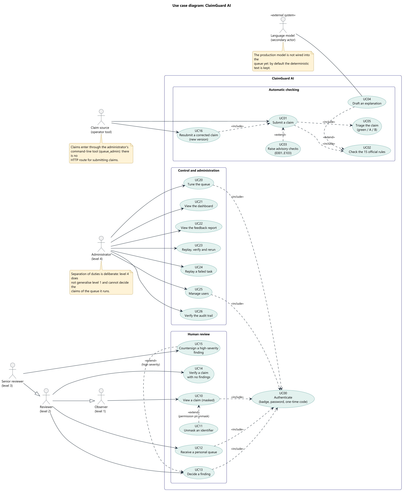

Human actors are ordered by **generalisation** (senior is a reviewer is an observer); the administrator stands apart on purpose. The language model is a **secondary actor** (an external system). `UC00 Authenticate` is included by the human use cases; `UC15 Countersign` **extends** `UC13 Decide a finding` under the condition "high severity"; `UC11 Unmask` extends `UC10 View a claim`; `UC16 Resubmit a corrected claim` includes `UC01`. The notes record two honest limits: claims enter through the command-line tool, and the production model is not wired to the queue.

#### 02. Class diagram: business domain

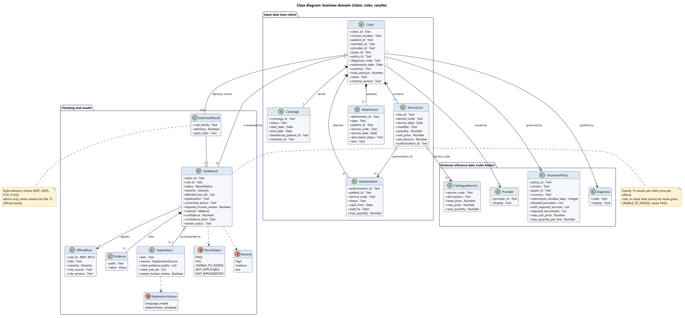

A `Claim` **composes** its lines, coverage, authorisations and attachments and **references** a provider, a policy and a diagnosis. It is evaluated by exactly 15 `RuleResult`. `ExtensionResult` **specialises** `RuleResult` (same fields plus the rule family and the advisory flag). Enumerations carry statuses, severities and the explanation source.

#### 03. Class diagram: queue, decisions, access, audit

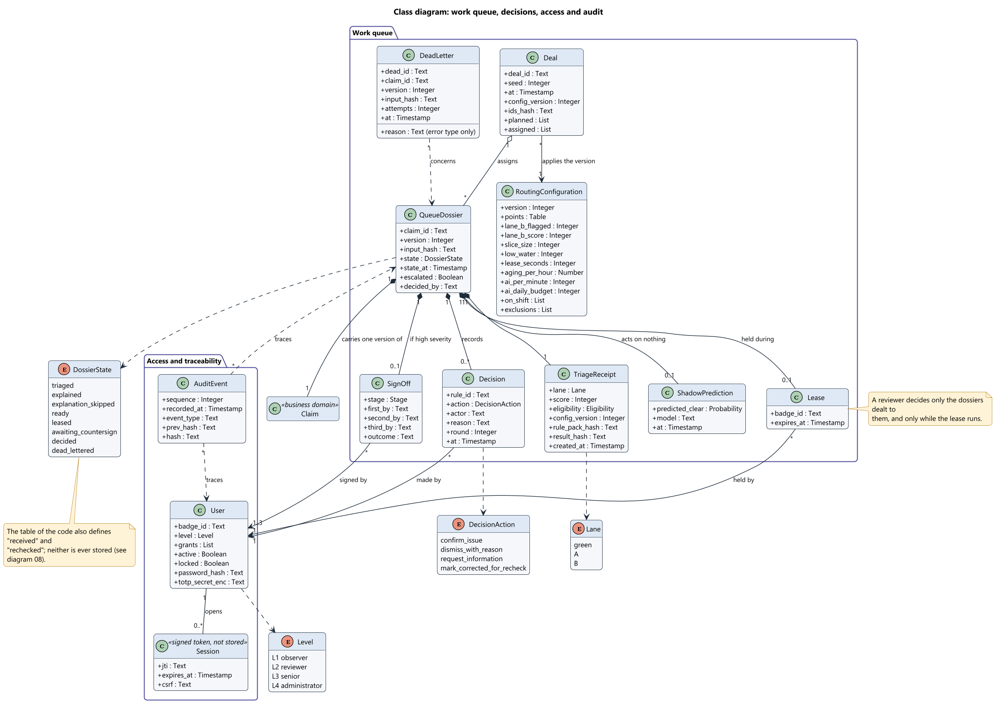

`QueueDossier` carries one version of a claim and **composes** its receipt, lease, decisions, sign-off and shadow prediction. `Session` is a signed token, not a stored entity. `AuditEvent` forms a hash chain. The note records that the code's table defines two states that are never stored.

#### 04. Sequence diagram: from submission to decision

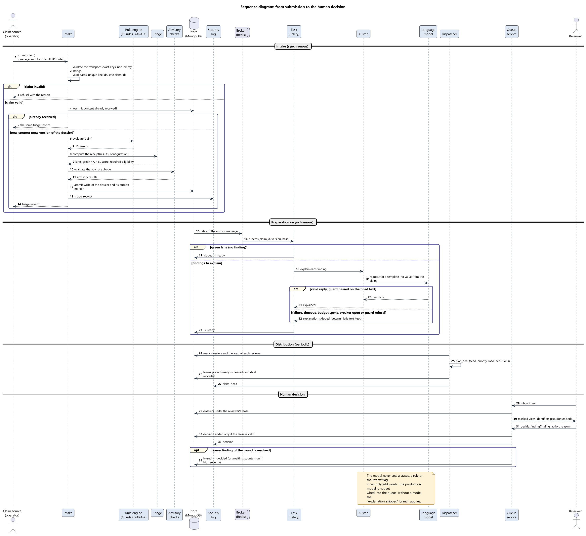

Four phases separated by dividers: intake (synchronous), preparation (asynchronous), dealing (periodic), human decision. The `alt` and `opt` fragments show invalid claim, content already received, green lane, model failure.

#### 05. Sequence diagram: sign-in and access control

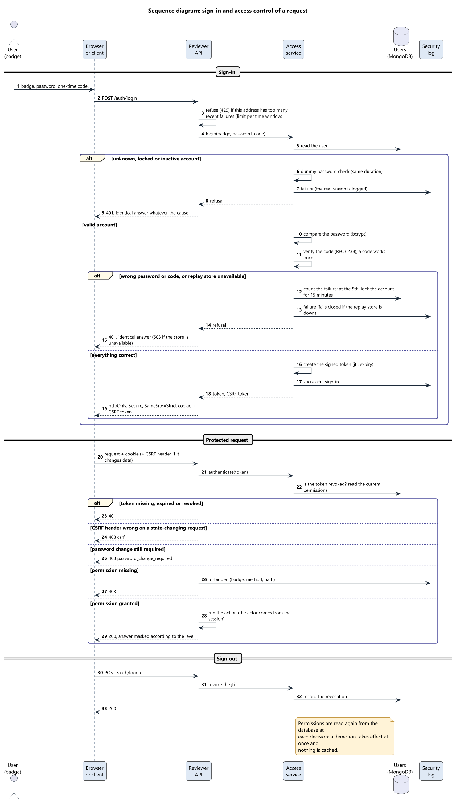

Sign-in, a protected request and sign-out. Failures have an identical answer, the account locks at the 5th failure, permissions are re-read at each decision, sign-out revokes the token.

#### 06. Sequence diagram: two-person sign-off

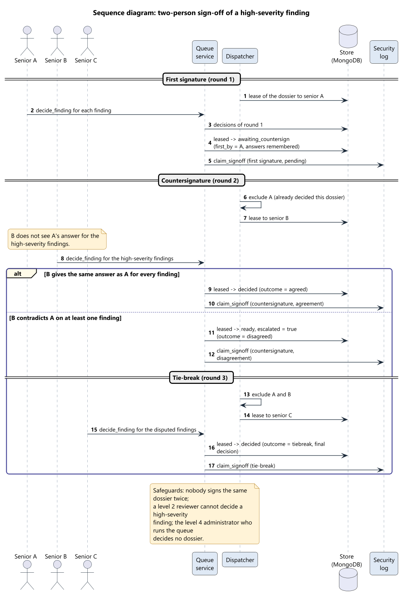

Three seniors, three rounds. The `alt` fragment separates agreement (decided) from disagreement (escalation then tie-break).

#### 07. Activity diagram

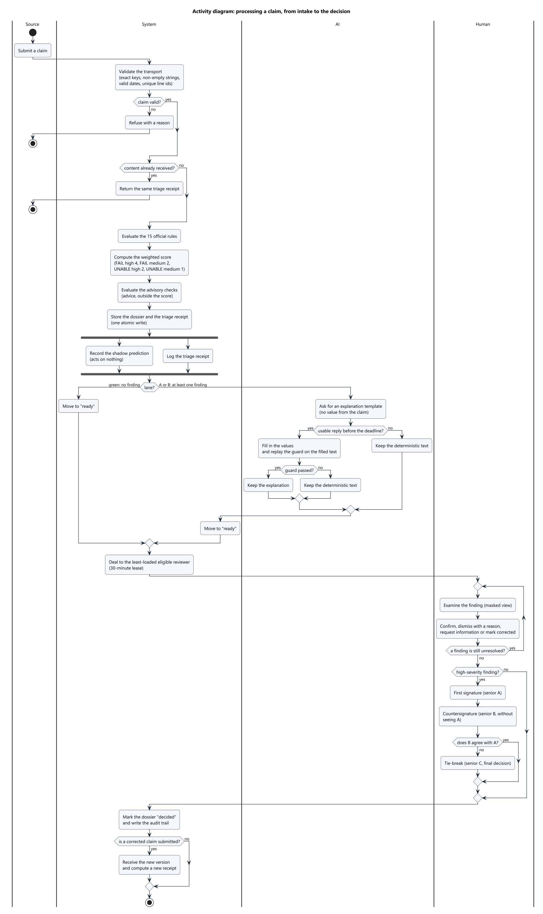

Four swimlanes (Source, System, AI, Human), a **fork** for the shadow prediction and the log, nested decisions, a review loop and three stop points.

#### 08. State machine diagram

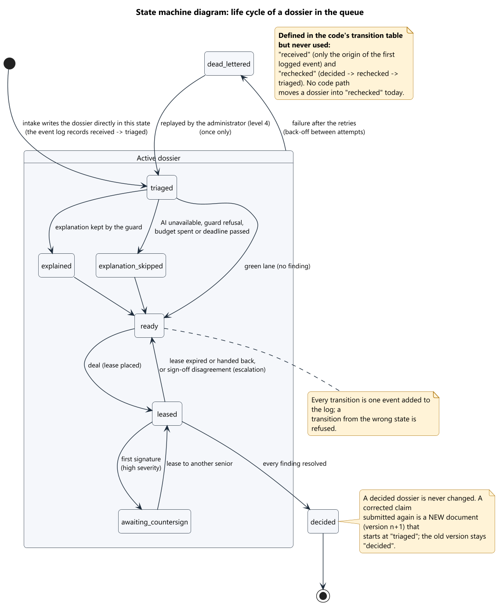

Ten states are defined in the code's transition table, which has 21 transitions. A dossier is created directly in `triaged`; the composite state "Active dossier" groups the states from which a failure leads to `dead_lettered`. **`received` (only the origin of the first logged event) and `rechecked` are defined but never used**; a correction is a new document (version n+1), not a transition. The diagram says so in a note.

#### 09 and 09b. Component diagrams

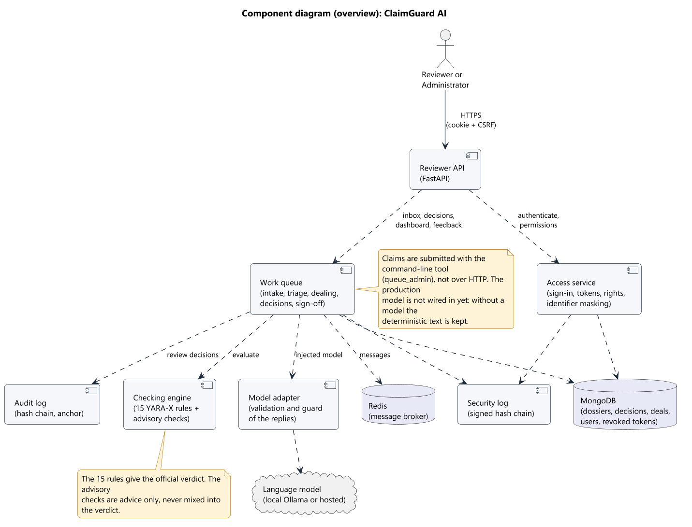

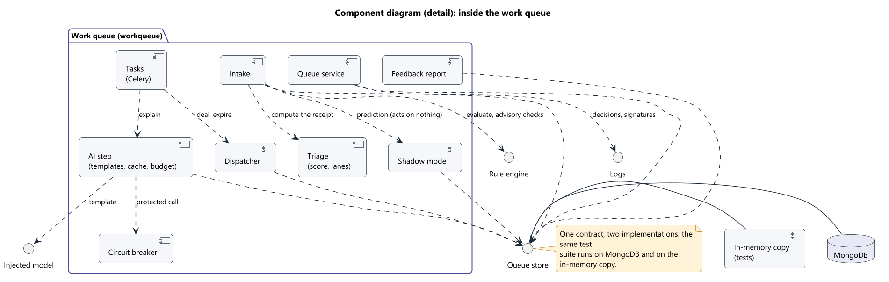

Two levels of abstraction. The detail shows the "Queue store" interface realised twice (MongoDB and an in-memory copy), which is what lets one test suite cover both.

#### 10. Deployment diagram

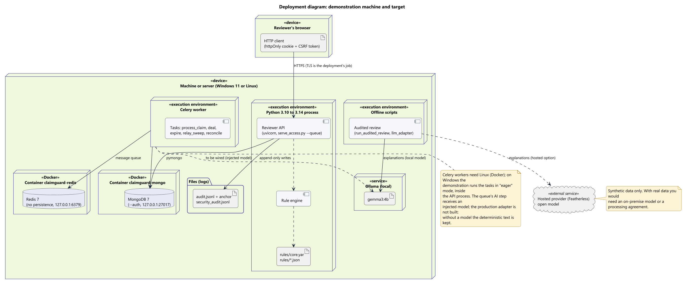

One machine (Windows or Linux): the API and engine in a Python process, a Celery worker, MongoDB and Redis in Docker containers, a local model (Ollama) used by the offline review scripts, a hosted option, and the log files. On Windows the Celery worker does not run; the demonstration runs tasks in "eager" mode inside the API process.

#### 11. Package diagram

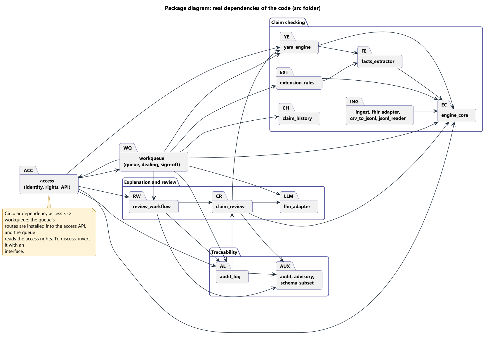

The arrows come from the real imports. It shows a **circular dependency** between `access` and `workqueue` (the queue's routes are installed in the access API, and the queue reads the access rights). We show it rather than hide it.

#### 12. NoSQL data model

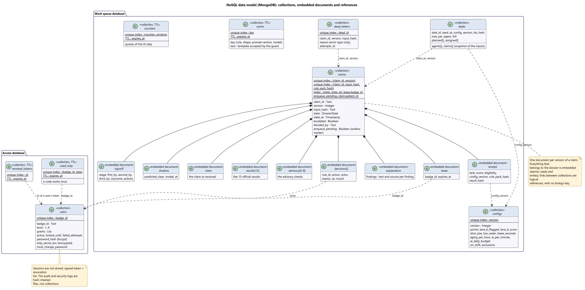

Nine collections. `claims` holds one document per **version** of a claim and **embeds** everything that belongs to it; links between collections are logical references with no foreign key. Four collections expire by TTL: `cache`, `counters`, `used_totp`, `revoked_tokens`.

#### 13. Failure and recovery

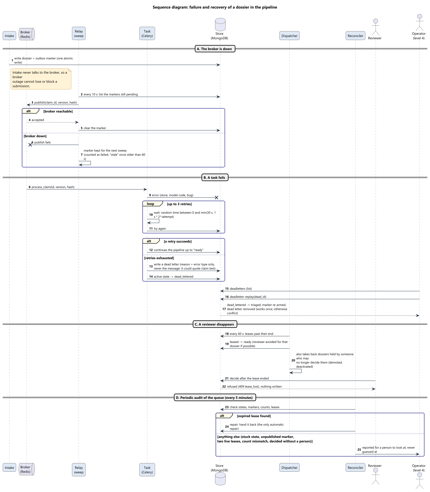

Four scenarios: the broker is down (outbox and relay sweep every 10 s), a task fails (3 retries with random back-off, a dead letter, one-time replay), a reviewer disappears (lease expiry every 60 s, late decision refused), and the periodic audit (every 5 minutes; one automatic repair, everything else reported).

### 8.1 Modelling choices open for advice

1. Is generalisation between clearance levels the right way to model roles in the use case diagram?
2. Should an embedded NoSQL document be modelled as a composition (as in diagram 03) or with a dedicated diagram (diagram 12)?
3. One large sequence diagram with phases (04), or one per phase?
4. Is the composite state in diagram 08 preferable to several transitions to the failure state?
5. Should the circular dependency in diagram 11 be removed in the code (dependency inversion) or only documented?
6. Which diagrams are still missing (object, communication, timing, composite structure)?

---

## 9. Traceability, limits and glossary

### 9.1 Traceability

| Requirement | Use cases | Diagrams | Main proof |
|---|---|---|---|
| FR-01, FR-02, FR-03 | UC01, UC02 | 02, 04, 07, 09 | `docs/29`; ingestion and rule tests |
| FR-04 | UC03 | 02, 04 | `docs/30` |
| FR-05 | UC05 | 02, 03, 04, 07 | `src/workqueue/triage.py` tests |
| FR-06 | UC04 | 01, 04, 07, 09, 10 | `src/llm_adapter.py`, `src/workqueue/explain.py`; partial |
| FR-07 | UC12 | 03, 04, 09b, 12, 13 | `src/workqueue/dispatcher.py` |
| FR-08, FR-17 | UC00, UC25 | 01, 03, 05, 12 | `SPECS.md` 10d |
| FR-09 | UC10, UC11 | 01, 04, 07 | `src/access/masking.py` |
| FR-10, FR-12 | UC13, UC14 | 04, 07, 08 | `src/review_workflow.py` |
| FR-11 | UC15 | 06, 08 | `docs/31`; sign-off tests |
| FR-13 | UC16 | 08 | Versions; recheck route not built (part 9) |
| FR-14, FR-15 | UC20, UC21, UC22 | 01, 09b | `routing_config.py`, `feedback.py` |
| FR-16 | UC23, UC24 | 13 | `scripts/queue_admin.py` |
| FR-18, FR-19 | UC26 | 03, 09 | `src/audit_log.py`, `shadow.py` |
| NFR-04, NFR-05 | UC04, UC24 | 13 | Fault and breaker tests |
| NFR-06, NFR-08 | UC00, UC11 | 05, 12 | `docs/32` |
| NFR-12 | all | 10 | `docker-compose.yml` |

### 9.2 What is not built, stated plainly

- **Console limits.** The web console exists (FR-20, docs/35) but has had no manual accessibility audit or phone test, refreshes by polling, and has no recheck screen.
- **No HTTP submission.** Claims enter through `queue_admin submit` (FR-21).
- **Production model not wired into the queue.** The AI step takes an injected model; with none, the deterministic text is kept (FR-06 partial). The offline flow does use a local or hosted model.
- **The recheck route is not built.** `POST /claims/{id}/recheck` answers 501. Correction is handled by resubmission as a new version (FR-13 partial).
- **State `rechecked` is unused** and `received` is never stored (diagram 08).
- **Two decision paths exist.** The base claims route (`/claims/{id}/findings/{rule}/decision`, offline claim store) and the queue route (`/work/claims/...`). The queue route is the main one.
- **Routing by model confidence** is not used (FR-22, a choice).
- **The audit log is tamper-evident, not immutable.** No write-once storage, no external timestamp (`docs/32`, part 4).
- **No encryption of claim data at rest.** Only the second-factor secret (encrypted) and passwords (hashed) are protected; masking is applied when data is shown.
- **Circular dependency** between `access` and `workqueue` (diagram 11).
- **AI latency figures** are from earlier recorded calls, not re-measured.
- **Open mentor questions:** may a trained model act in the decision path? may a green claim skip a human? what exactly were the "more than 15 rules"? is an on-premise model under 15 billion parameters mandatory?

### 9.3 Glossary

| Term | Meaning |
|---|---|
| Claim | A request for reimbursement of care, with its lines, coverage and documents |
| Rule | A deterministic check on a claim (R001 to R015 official; E001 to E103 advisory) |
| Finding | A `FAIL` or `UNABLE_TO_ASSESS` result of a rule |
| Triage receipt | Stored score, lane and eligibility computed at intake |
| Lane | Green, A or B: classification by score |
| Lease | Temporary assignment of a dossier to a reviewer |
| Deal | One run of the dispatcher, with its seed, replayable |
| Sign-off | Two different seniors for a high-severity finding, plus a third to settle a disagreement |
| Dossier | One version of a claim as held in the queue |
| Masking | Replacement of identifiers by stable pseudonyms |
| Guard | A mechanical check of text produced by the model |
| Shadow mode | A recorded prediction of a hypothetical automatic clearer; it acts on nothing |
| Outbox marker | A flag on a dossier meaning "not yet published to the broker" |
| Dead letter | A record of a task that failed all its retries |
| TTL | Time-to-live of a MongoDB document |

### 9.4 Regenerating the images

The sources are in `docs/uml/en/` (English) and `docs/uml/` (French). With Java and the `plantuml.jar` file (published on Maven Central; verify its SHA-1 checksum), from `docs/uml/en/`:

```
java -jar plantuml.jar -tpng -charset UTF-8 -o ../../figures/uml/en *.puml
```

The images were produced with PlantUML 1.2026.8. `docs/uml/style.iuml` sets the common look.
