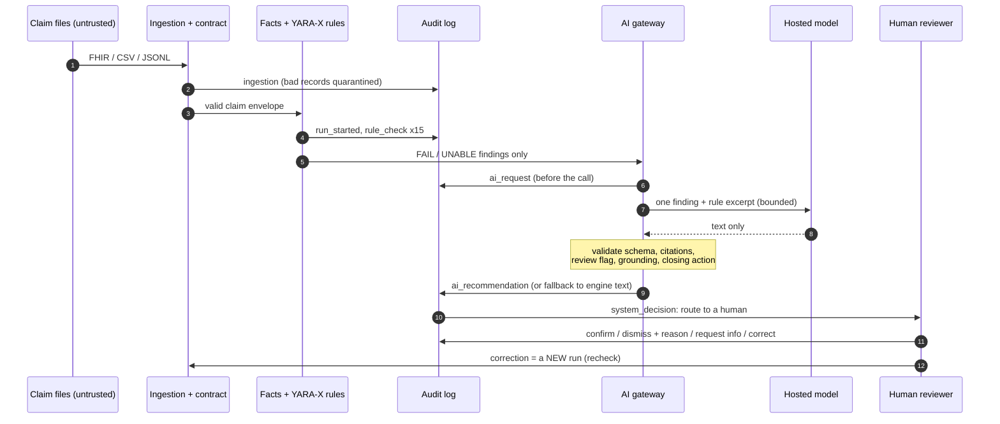
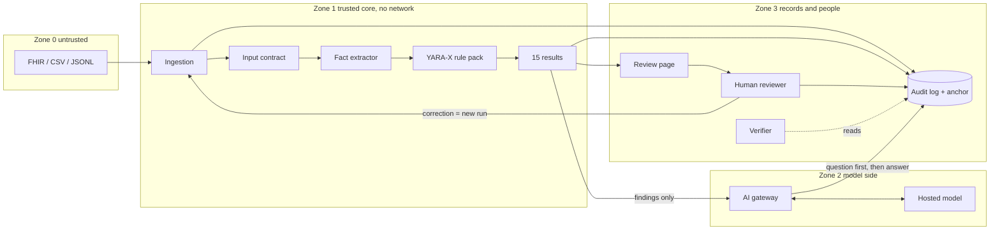

# 22. Architecture and Data Flow

This is the Phase 1 architecture and data-flow document for ClaimGuard AI. It answers four questions: what are the parts, where is the trust boundary, what may each part touch, and what happens to one claim from file to audit record. Everything here describes code that exists in this repository; nothing is a plan.

Regenerate the pictures with `python scripts/draw_diagrams.py` (needs matplotlib, see `experiments/requirements-experiments.txt`). The Mermaid sources at the end render on GitHub without it.

## 1. Architecture

The system has four zones, and one rule binds them: **the engine decides, the model only explains.**

| Zone | What lives there | Trust |
|---|---|---|
| 0. Untrusted input | Claim files (FHIR R4, CSV, JSONL) and the free text inside them (notes, attachment text) | Never trusted. Anything can be malformed, hostile or wrong. |
| 1. Trusted core | Ingestion, input contract, fact extractor, YARA-X rule pack, rulebook data, the 15 results | Deterministic code with no network access. Same input, same output. |
| 2. Model side | The hosted language model and the AI gateway (`src/llm_adapter.py`) | The model is untrusted. Its output is only used after the gateway validates it. |
| 3. Records and people | Audit log, review events, review page, human reviewer, verifier, recheck | The log is tamper-evident. Humans make the decisions. |

### Components

| Component | File | Job |
|---|---|---|
| Ingestion | `src/ingest.py`, `src/fhir_adapter.py`, `src/csv_to_jsonl.py`, `src/jsonl_reader.py` | Detects the format, converts to one claim envelope, sends unreadable records to quarantine and counts them |
| Input contract | `schemas/claim.schema.json`, `src/claim_review.py` | A closed schema. A claim that fails it is not guessed at: it gets 15 `UNABLE_TO_ASSESS` results |
| Fact extractor | `src/facts_extractor.py` | One function per rule turns the claim into facts and evidence paths. Claim text is percent-encoded before it reaches the rule pack, so a value cannot inject a fact |
| Rule pack | `rules/core.yar`, `src/yara_engine.py`, `src/run_yara.py` | Declarative YARA-X rules. Precedence FAIL > UNABLE_TO_ASSESS > NOT_APPLICABLE > PASS |
| Rulebook data | `rules/rules.json`, `rules/policies.json`, catalogues | Read-only files: rule text, corrective actions, fictional policies and service codes |
| Result | `schemas/result.schema.json` | Exactly 15 schema-checked results per claim |
| Advisory checks | `src/advisory.py` | Extra observations (for example duplicate claim ids). Logged, never a rule result |
| AI gateway | `src/llm_adapter.py` | Builds the bounded prompt, calls the model, repairs cited-path slips, validates, grounds, checks the closing action, or falls back to the engine's own sentence |
| Audit log | `src/audit_log.py`, `docs/16_Audit_Log_Design.md` | Hash-chained append-only log plus an anchor file (optional HMAC via `AUDIT_ANCHOR_KEY`) |
| Review page and workflow | `src/make_review.py`, `src/review_workflow.py` | Shows findings to a person, records confirm / dismiss + reason / request info / correct, runs a recheck as a new run |
| Verifier | `scripts/verify_audit.py` | Read-only: checks the chain, the anchor, that every AI question precedes its answer, and that result hashes match a fresh run |

## 2. Trust boundaries

| Boundary | Crosses from, to | What is enforced |
|---|---|---|
| B1 | Files into the system | Format detection, size and shape limits, quarantine of bad records, closed claim schema |
| B2 | Claim data into rule facts | Percent-encoding of every claim string (`_q`), strict `YYYY-MM-DD` dates, wide decimal arithmetic |
| B3 | Findings out to the model | Only one finding plus its rule excerpt. Free-text notes go in a fenced block labelled DATA ONLY. Limits: 1,000 characters per value, 4,000 for a note, 60,000 for the whole prompt |
| B4 | Model reply back in | JSON schema, only the allowed rule id and evidence paths, the review flag must equal the engine's, garbled-text and repetition guards, grounding, closing-action check. Anything else is rejected |
| B5 | Decisions into the record | Every event appended to the hash chain; the AI question is written before the model is called |

## 3. Tool permissions

What each component may read, write and reach. The last column is the point of the table: **no component that touches a network or free text can change a verdict.**

| Component | Reads | Writes | Network | Can it change a verdict? |
|---|---|---|---|---|
| Ingestion | Input files | Normalized JSONL, quarantine file, ingest report | No | No, it only normalizes; a bad record becomes UNABLE, not a pass |
| Fact extractor | Claim envelope, rulebook data | Nothing | No | It supplies facts; the rule pack decides |
| Rule pack (YARA-X) | Facts | Nothing | No | **Yes, it is the only decider** |
| AI gateway | One finding, one rule excerpt, one bounded note | Nothing (returns text) | **Yes, one hosted endpoint, only here** | **No.** It cannot set a status, and a changed review flag is rejected |
| Hosted model | The prompt it is sent | Nothing | n/a | **No.** It has no tools, no files and no memory. It returns text |
| Audit log writer | Events | Append-only log, anchor file | No | No |
| Review workflow | Results, reviewer input | `review_decisions.jsonl`, audit events | No | No. A human decision is a new event; the original result is never edited |
| Recheck | A corrected claim | A **new** run and new audit events | No | It produces a new result for a new claim version; the old one stays |
| Verifier | Log, anchor, results | Nothing | No | No |

Secrets: the only secret is `FEATHERLESS_API_KEY`, read from the environment or `.env` (which is git-ignored) and used only by the AI gateway. The audit anchor key `AUDIT_ANCHOR_KEY` is optional and used only by the audit log and the verifier.

## 4. Data flow of one claim

| Step | What happens | Where | Audit event |
|---|---|---|---|
| 1 | The claim file, FHIR bundle or CSV folder is read | `src/ingest.py` | |
| 2 | It is normalized into one claim envelope. An unreadable record goes to quarantine and is counted | `src/ingest.py` | `ingestion` |
| 3 | For each of the 15 rules, facts and evidence paths are extracted | `src/facts_extractor.py` | |
| 4 | YARA-X evaluates the rule pack and returns an outcome per rule | `rules/core.yar` | |
| 5 | 15 results are built and checked against the result schema. Unknown data is `UNABLE_TO_ASSESS`, never a pass | `src/claim_review.py` | |
| 6 | Each result is logged with status, hash and versions | `src/audit_log.py` | `run_started`, `rule_check` x15 |
| 7 | For each FAIL or UNABLE finding, the AI question is written to the log **before** the model is called | `src/audit_log.py` | `ai_request` |
| 8 | The gateway sends one finding and the rule excerpt to the model in a bounded prompt | `src/llm_adapter.py` | |
| 9 | The gateway repairs cited-path slips, validates the reply, and checks grounding, the review flag and the closing action. If anything fails, the engine's own sentence is used | `src/llm_adapter.py` | |
| 10 | The answer (and which model wrote it, any repairs, any tier errors) is logged | `src/audit_log.py` | `ai_recommendation` or `ai_failure` |
| 11 | The system routes the claim to a human. It never approves | `src/audit_log.py` | `system_decision`, `advisory_check`, `run_finished` |
| 12 | The reviewer sees finding, evidence and explanation on the review page | `src/make_review.py` | |
| 13 | The reviewer confirms, dismisses with a reason, requests information or supplies a correction | `src/review_workflow.py` | |
| 14 | The decision is logged with actor, reason and time | `src/audit_log.py` | reviewer decision events (`append_review_decisions`) |
| 15 | A corrected claim is a **new run**: steps 2 to 11 again. The original claim and results are not edited | `src/review_workflow.py` | `recheck_run` |

Verification at any time: `python scripts/verify_audit.py --log <audit.jsonl>` re-checks the chain, the anchor, that every AI question precedes its answer, and (with `--results`) that every result hash matches a fresh run of the engine.

## 5. Data stores

| Store | Format | Written by | Contents |
|---|---|---|---|
| `outputs/**/audit.jsonl` | JSONL, hash chain | Audit log writer only, append-only | Every event above |
| `outputs/**/audit.jsonl.head.json` (the anchor, named `<log>.head.json`) | JSON | Audit log writer | Head hash and length (HMAC-signed when `AUDIT_ANCHOR_KEY` is set) |
| `outputs/**/results.jsonl` | JSONL | Rule engine | 15 results per claim |
| `outputs/**/review_decisions.jsonl` | JSONL | Review workflow | Human decisions |
| the file named by `--quarantine` (for example `outputs/quarantined.jsonl`) | JSONL | Ingestion | Records that could not be read, with the reason |
| `data/`, `rules/` | Read-only inputs | Nobody at run time | Synthetic claims, rules, catalogues |

All data is synthetic. No real patient data is used anywhere.

## 6. What happens when something goes wrong

The system fails closed: an error produces a visible, safe result, never a silent pass and never a crash that hides a claim.

| Failure | Result |
|---|---|
| Unreadable or non-JSON line in a claim file | Quarantined and counted in the ingest report; the rest of the file continues |
| Claim fails the input contract | 15 `UNABLE_TO_ASSESS` results, routed to a human |
| A rule cannot be evaluated (missing data, crash) | `UNABLE_TO_ASSESS` for that rule, never PASS |
| Duplicate claim id | Flagged with a `duplicate_submission` event for a human |
| Model unreachable, times out, or rate limited | The engine's own template sentence is used; the run continues |
| Model reply is not JSON, cites a path that does not exist, is garbled or repetitive, is ungrounded, or changes the review flag | Rejected; the engine's own sentence is used |
| Model reply lacks the rule's corrective action | One more attempt; the better valid answer wins, a worse one never replaces a valid one |
| Prompt injection in a note | The note is fenced as data and the reply is validated; injection cannot change a status. A followed injection that flips the review flag is rejected by the gateway |
| Audit log edited after the fact | `verify_audit.py` reports the first broken link; with an HMAC key the anchor cannot be re-forged |

## 7. Sequence diagram (Mermaid)

## 8. Flowchart (Mermaid)

## 9. Limits of this design

- Tamper-evident is not immutable: a production system would add write-once storage and an externally held anchor (`docs/16_Audit_Log_Design.md`).
- Reviewer identity is self-declared in the offline file-based flow. The reviewer API (`src/access/`, SPECS 10d) authenticates with badge, password and authenticator code and takes the reviewer from the session.
- The hosted model is an external dependency. With no key or no network the system still works using the deterministic template.
- The threat model and the OWASP mapping are in `docs/20_Security_Audit.md`.
