# 31. Task queue and work dispatcher

Every claim is checked by the rule engine, given a **triage receipt** and a **lane**, explained by the AI where that helps, and then dealt by
a **dispatcher** into the personal inbox of an eligible person. A person decides it. **No claim is ever cleared, closed or decided
without a human badge on the decision**, and the AI step can only ever add words: if it is slow, down, over budget or wrong, the claim
keeps the engine's own explanation and carries on.

Design: `docs/superpowers/specs/2026-10-04-task-queue-dispatcher-design.md`. Plan: `docs/superpowers/plans/2026-10-05-task-queue-dispatcher.md`.
Code: `src/workqueue/` (the name `queue` would shadow Python's standard module). Evidence: `outputs/defense/queue.json`.

## The pipeline

```mermaid
flowchart LR
  A[claim submitted] --> B[Intake: validate, run the 15 rules,<br/>triage receipt, ONE atomic write]
  B --> C[(MongoDB: the truth)]
  C --> D[Outbox relay publishes<br/>process_claim to Redis]
  D --> E{lane}
  E -- green --> G[ready]
  E -- A or B --> F[AI explanation step<br/>breaker, budget, cache, guard]
  F --> G
  G --> H[Dispatcher deals into a<br/>personal inbox: lease]
  H --> I[A person decides<br/>fresh permissions, lease-bound]
  I -- medium findings only --> J[decided]
  I -- a high finding --> K[awaiting_countersign]
  K --> L[a DIFFERENT senior]
  L -- agrees --> J
  L -- disagrees --> M[ready, escalated:<br/>a third senior, final]
  M --> J
```



Redis is only the Celery broker. MongoDB holds every claim, so losing Redis loses nothing: intake writes the claim and its "publish
pending" marker in one document, and the relay republishes any marker still set (a crash between the write and the publish is the same
case). Delivery is at least once and `process_claim` is idempotent, so a duplicate does nothing.

## Triage: where a claim goes

A finding is **flagged** when its status is `FAIL` or `UNABLE_TO_ASSESS`. Each flagged finding scores points; the numbers are defaults in the
versioned routing configuration, never constants in code.

| Flagged finding | high | medium |
|---|---|---|
| FAIL | 4 | 2 |
| UNABLE_TO_ASSESS | 2 | 1 |

| Lane | When |
|---|---|
| **green** | nothing flagged |
| **A** | one to three flagged and a score below 10 |
| **B** | four or more flagged, or a score of 10 or more |

**Eligibility** is separate: any flagged high-severity finding needs `claims.decide_high` (`decide_high`); otherwise `claims.decide`.
Worked example: two FAIL-high and one FAIL-medium = 4 + 4 + 2 = 10 points, lane B, senior needed.

**Fail closed.** A result set that is not exactly the 15 official rules, each once, with known statuses and severities, is *degraded*:
lane B, senior needed, never green. An unknown severity counts as high. The receipt records the rule-pack hash, engine version, input
hash, result hash, configuration version and a `degraded` flag, and is also written to the security log.

On the 600 public claims: 201 green, 324 lane A, 75 lane B (an independent oracle in `tests/oracle_routing.py` agrees on every claim).

## The dispatcher: dealing without waiting

An agent never sees the whole pool. Each holds at most `slice_size` (25) claims, **leased** one by one; the inbox is topped up when it
falls below `low_water` (5), so nobody waits for work while work exists. Nobody assigns a particular claim to a particular person.

1. **Eligible agents**: active, on shift, with room, holding the permission the claim needs.
2. **Order**: the claims are shuffled with a *logged random seed* (so ties are random but reproducible), then stably sorted by
   `score + 0.5 * hours waited` (aging: a score-2 claim waiting 40 hours outranks a fresh score-12).
3. **Choice**: each claim goes to the eligible agent with the least work so far (sum of scores already held plus dealt), ties broken by the
   seeded order. This is greedy balancing; the invariant is tested: with equal agents the spread of loads never exceeds the largest claim.
4. **Conflicts of interest**: an agent never gets a later version of a claim they decided, nor a `(badge, patient)` pair on the
   configuration's exclusion list, nor a claim they already signed. A claim handed back from someone goes to somebody else first when there
   is anybody else.
5. **Only the newest version** of a claim is dealt; a lease on a superseded version is taken back.

Every deal stores its inputs, so `Dispatcher.replay(deal_id)` re-derives the plan and `verify(deal_id)` proves the stored assignments are
what the algorithm gives for that seed (`queue_admin.py verify-deal` exits non-zero if the seed or inputs were altered).

## The states

`received` -> `triaged` -> `explained` | `explanation_skipped` -> `ready` -> `leased` -> `decided` -> `rechecked` -> `triaged`, with
`awaiting_countersign` (a claim signed once, waiting for a second senior) and `dead_lettered` (a task that failed its retries) as side
states. Every move is one **conditional database update that also appends its event**; a move from the wrong state changes nothing. A
10 x 10 table test pins the allowed pairs against a literal copy.

## Decisions are bound to the lease and to fresh permissions

* A person decides only a claim **leased to them** and only while the lease runs; a claim that is not theirs is `404`, one they lost is `409`.
* Permissions are **read from the user store again at the moment of a decision**: a token's claims are not trusted. A demoted or
  deactivated agent gets `403`, nothing is written, and the next `expire` or `deal` returns the claim to the pool.
* The decision is written by **one conditional update** (`add_decision`) that checks the lease holder and expiry, so a decision that loses a
  race with an expiry or a re-deal is refused and writes nothing; the final move to `decided` is guarded the same way.
* The actor is the session's badge. The body is strict and refuses unknown fields (actor, state, original status can never be chosen).
* Level 4 holds `queue.view` and `routing.manage` but **not** `claims.decide`: whoever runs the queue cannot decide its claims.
* Green claims are also verified by a person (`verify_clear`) or escalated to a senior; shadow mode (below) only *records* what an
  automatic clearer would have done.

### Two-person sign-off for high severity

A claim with a high-severity finding is signed by one senior (the first resolves every finding), then waits in `awaiting_countersign`. A
**different** senior is dealt it and decides the high findings again **without seeing the first answer** (the first signer's badge and
actions are absent from the view). Agreement decides the claim with both badges on the record; disagreement sends it, escalated, to a
**third** senior whose decision is final, and neither of the first two is ever dealt it again. Medium findings need one decision. With only
one senior on shift the claim waits and the dashboard says so.

## The AI explanation step

For each flagged finding the step asks for an explanation **template** with `{value}` and `{line}` in place of any claim value; the model
never sees a claim value. Claim values are filled in afterwards and the existing grounding guard (clinical, fraud, approval, garbled-text
checks) runs on the **filled** text every time, cached or not.

| What | Cached | Why |
|---|---|---|
| Template text with placeholders, keyed by (rule, failure shape, prompt version, model) | yes, only after the guard approved a fill | no claim value in the key or the text |
| Filled text, claim values, evidence | **never** | would hold identifiers |
| Permissions, sessions, clearance | **never** | a demotion must apply at once |
| Rule results of a claim | in the claim document (the receipt hashes them) | replay compares |

A **circuit breaker** (opens on 5 transient failures in a row, or 50 % of at least 20 calls over 60 s; one probe after a 20 s cool-down)
protects the queue; `Fatal` errors (a rejected request) never count. A per-minute and a per-day budget are counted in the database (not
Redis), a hard 90-second deadline is passed to the model, and transient failures are retried with full-jitter backoff. With **no model
configured** every claim keeps the engine's text (`skipped_no_model`); that is the default.

## Replay, rerun and dead letters

`queue_admin.py` (a level 4 operator signs in with badge, password and authenticator code; every use is logged; it never prints a secret):
`replay` re-runs a stored claim and also checks the stored claim and results against the receipt hashes (an edit made in the database
after intake is caught); `rerun --rule-pack OLD [--apply]` finds claims evaluated by an old rule pack and, only when results changed,
creates a **new version** with a new receipt, leaving the old version and its decisions untouched; `deadletters` and `deadletter-replay`
move a dead-lettered claim back once only; `reconcile` reports claims stuck in a state, unpublished markers, count mismatches and two live
leases, and repairs only an expired lease; `submit` loads claims.

## Shadow mode and the mentor's question

Each new claim gets a stored prediction `would_clear` from a plain baseline (green = clear). It is written once, acts on nothing, and
`agreement()` reports how often the people's outcome matched, with an **exact** (Clopper-Pearson) 95 % interval. Whether any trained model
may sit in the decision path at all is an open question for the mentor; this build gives the interface and the measurement, not the model.

## Running it

```
docker compose up -d mongo redis            # MongoDB for the truth, Redis only as the Celery broker
export MONGO_URI=... REDIS_URL=redis://127.0.0.1:6379/0
python scripts/serve_access.py --queue      # the reviewer API with the queue routes
celery -A workqueue.tasks worker --beat     # Linux (the Docker image); on Windows the demo runs the tasks eagerly
python scripts/queue_admin.py --badge CG-4004 submit --claims data/development/claims.jsonl --process
```

Routes: `GET /api/v1/work/inbox`, `POST /work/next`, `POST /work/heartbeat`, `POST /work/claims/{id}/findings/{rule}/decision`,
`POST /work/claims/{id}/verify`, `GET /queue/dashboard`, `GET|PATCH /queue/config`. There is deliberately no route that assigns or moves a
particular claim.

## Evidence

`python scripts/queue_experiments.py` (500 public claims, 20 agents, slice 25, a simulated clock; **the people and the model are simulated**
and the output says so). Seed 1, committed in `outputs/defense/queue.json`:

| Scenario | Seniors | Time to drain (simulated) | Left undecided |
|---|---|---|---|
| 4 seniors of 20 | 4 | 2.97 h (seniors busy 96.5 %, juniors 10.9 %) | 0 |
| plus 4 L2 agents granted the senior flag | 8 | 1.82 h | 0 |
| no senior on shift | 0 | n/a | 253 of 253 high claims |
| two-person sign-off, 4 seniors | 4 | 5.66 h (786 signatures, 33 escalations) | 0 |
| two-person sign-off, 8 seniors | 8 | 3.07 h | 0 |

253 of the 500 claims need a senior, so the seniors are the bottleneck; four-eyes review roughly doubles their load. Invariants held over
five seeds: no claim in two inboxes, no agent above a slice, nobody decided a claim they may not (100 %), nobody signed a claim twice.
Within a class the load is even (coefficient of variation 0.045 among seniors, 0.034 among juniors). The template cache served 632 of 665
flagged findings (95.0 %) with 33 model calls. Shadow agreement 484 of 500 (96.8 %, 95 % interval 94.9 to 98.2 %), which describes the
simulated people.

Tests: `tests/test_wq_*.py` (contract suite run on the in-memory twin and on MongoDB, races with real threads, fault injection, a real
Celery worker against Redis, an independent routing oracle and a dealing-invariant oracle, Hypothesis). `tests/mutation_queue.py` breaks
the queue code in 75 ways (a threshold off by one, a guard removed, a sort reversed) on a temporary copy; every mutant must be caught.

## Limits and open risks

* The production model adapter (wrapping `llm_adapter`) is not built; the step takes an injected model and guard. Its explanation quality
  has not been measured on the queue's template prompt.
* Capacity is advisory under several dispatchers dealing at once (a claim is never in two inboxes, but an inbox can briefly exceed a slice);
  the scheduler runs one deal task.
* A decision is written to the claim first and to the review log second; a crash between the two leaves a decision without its log row.
* "Pending" actions (`request_information`) keep a claim in the inbox until its lease runs out.
* Celery workers need Linux; the Windows demo runs the tasks eagerly. Redis outage: nothing is lost, delivery waits for the relay.
* Everything about people and timing in the experiment is a simulation.
