# 33 | Cahier des charges et modélisation UML de ClaimGuard AI

*Document en français, destiné à l'enseignant d'UML de l'équipe. Il décrit le système, fixe son cahier des charges, présente les diagrammes UML déjà dessinés et pose les questions sur lesquelles nous attendons ses conseils.*

**Comment lire ce document.** La partie 1 présente le projet et la partie 2 décrit le fonctionnement du système en langage courant. La partie 3 donne les acteurs, la partie 4 le périmètre et la partie 5 le cahier des charges proprement dit (exigences, contraintes, règles de gestion, fiches de cas d'utilisation). La partie 6 montre les treize diagrammes UML dessinés, chacun avec ses choix de modélisation. La partie 7 liste nos questions à l'enseignant. Les parties 8 à 11 contiennent la traçabilité, les limites, le glossaire et la façon de régénérer les images.

**Ce qui est vrai de tout le document.** Chaque diagramme a été vérifié contre le code : la machine à états reprend exactement la table de transitions, les collections correspondent à celles que le code crée, les dépendances entre paquetages viennent des instructions d'importation. Ce qui n'est pas réalisé est écrit comme tel (voir la partie 9). Les sources des diagrammes (fichiers PlantUML modifiables) sont dans `docs/uml/` et les images dans `docs/figures/uml/`.

---

## 1. Présentation générale

### 1.1 Contexte

ClaimGuard AI est le projet de l'équipe pour le défi **CSTAM-VELODOC** (mentor : Dr Wael Hilali, Velodoc / Amazit). Il s'agit d'un défi étudiant : toutes les données (patients, codes, prix, règles du payeur) sont **synthétiques**, rien n'est un vrai système de remboursement, et aucune donnée réelle de santé ne doit entrer dans le dépôt.

### 1.2 Le problème

Avant qu'une demande de remboursement de soins (une *réclamation*) soit envoyée à l'assureur, un agent doit vérifier qu'elle est correcte : informations complètes, dates cohérentes, couverture active, prix et quantités dans les limites, autorisation préalable présente, etc. Ce travail est répétitif, les erreurs coûtent du temps et de l'argent, et un outil automatique qui « décide à la place de l'agent » serait dangereux.

### 1.3 Objectifs du système

1. **Détecter** automatiquement les anomalies d'une réclamation, avec une exactitude mesurable.
2. **Expliquer** chaque anomalie à l'agent : quelle règle, quelle preuve, quelle action corrective.
3. **Faire décider un humain** : chaque réclamation, même sans anomalie, est vue par une personne ; le système ne ferme jamais une réclamation tout seul.
4. **Répartir le travail** entre plusieurs relecteurs de façon équitable, vérifiable et rejouable.
5. **Tracer** chaque décision et chaque déplacement, de manière à pouvoir tout contrôler après coup.
6. **Protéger** les données et limiter les droits de chacun.

### 1.4 Ce que le système n'est pas

- Il ne **paie** rien, n'approuve rien et ne soumet rien à un assureur.
- Il ne pose aucun **diagnostic** et ne juge pas la nécessité médicale d'un acte.
- Il n'utilise pas de **vraies données** de patients.
- L'intelligence artificielle **n'a aucun pouvoir de décision** : elle ne peut que rédiger des explications.

---

## 2. Description du système en langage courant

### 2.1 Le parcours d'une réclamation

1. **Dépôt.** Une réclamation arrive sous forme de fichier (FHIR R4 JSON, CSV ou JSONL). Elle est convertie en une représentation interne unique ; un enregistrement mal formé est mis en quarantaine avec une raison, jamais ignoré en silence. Le dépôt se fait aujourd'hui par un outil en ligne de commande pour l'administrateur, pas par une page web.
2. **Contrôle par quinze règles.** Un moteur déterministe applique les quinze règles du payeur fictif (R001 à R015). Pour chaque règle, il rend un résultat : `PASS`, `FAIL`, `UNABLE_TO_ASSESS` (information manquante pour juger) ou `NOT_APPLICABLE`, avec la gravité, les lignes concernées, la preuve et l'action corrective. Un contrôle impossible n'est **jamais** affiché comme réussi.
3. **Contrôles complémentaires.** Huit autres contrôles (E001 à E005, E101 à E103), inspirés de la pratique réelle, donnent des **conseils** séparés. Ils ne changent jamais le verdict officiel.
4. **Triage.** Le système calcule un **score pondéré** (un constat grave compte plus qu'un constat moyen, un contrôle impossible compte moins qu'un échec) et classe la réclamation dans une **voie** : *verte* (aucun constat), *A* (quelques constats) ou *B* (beaucoup de constats, ou résultat dégradé). Il écrit un **reçu de triage** qui reste consultable.
5. **Explication par IA, sous contrôle.** Pour chaque constat, un modèle de langage peut proposer une explication. Il ne voit **aucune valeur** de la réclamation (seulement des emplacements `{value}` et `{line}`), les valeurs sont insérées ensuite, et une **garde** vérifie le texte rempli. Si le modèle échoue, tarde, dépasse son budget ou si la garde refuse, le texte déterministe du moteur est conservé.
6. **Distribution.** Un **distributeur** place les réclamations prêtes dans la boîte personnelle de relecteurs habilités (25 par personne par défaut). Chaque attribution est un **bail** de 30 minutes. La répartition utilise une **graine** enregistrée : on peut la rejouer et vérifier que le plan était bien celui que l'algorithme donne.
7. **Décision humaine.** Le relecteur voit une vue **masquée** (les identifiants du patient sont remplacés par des pseudonymes), choisit une action par constat (confirmer, écarter avec un motif, demander une information, marquer corrigé), et le système enregistre qui a décidé, quand et pourquoi. Un constat de **gravité élevée** exige deux seniors différents ; s'ils ne sont pas d'accord, un troisième tranche.
8. **Traçabilité et correction.** Chaque événement est ajouté à un journal à **chaîne de hachage**. Une correction ne modifie pas le dossier décidé : elle crée une **nouvelle version**, qui repart au triage.

### 2.2 Principes de conception

| Principe | Ce que cela veut dire |
|---|---|
| Le moteur déterministe a le dernier mot sur les faits | L'IA ne fixe ni un statut, ni une règle, ni l'indicateur « à relire » |
| Tout passe par un humain | Même une réclamation verte est vérifiée par une personne |
| Tout est rejouable | Graine, empreinte du paquet de règles, version de la configuration : on peut refaire et comparer |
| Moindre privilège | Chaque niveau n'a que les droits nécessaires ; le niveau qui pilote la file ne décide aucun dossier |
| Échec fermé | Si un contrôle de sécurité ne peut pas s'exécuter, l'accès est refusé |

---

## 3. Acteurs et parties prenantes

| Acteur | Type | Rôle | Droits principaux |
|---|---|---|---|
| Source de réclamations | Humain ou script | Dépose des réclamations (via l'outil d'administration) | Dépôt seulement |
| Observateur (niveau 1) | Humain | Consulte les constats, preuves et explications, masqués | `claims.view` |
| Relecteur (niveau 2) | Humain | Décide les constats de gravité moyenne, voit les notes, relance après correction, démasque un identifiant avec un motif | + `claims.view_notes`, `claims.decide`, `claims.recheck`, `pii.unmask` |
| Relecteur senior (niveau 3) | Humain | Décide aussi les constats de gravité élevée, signe et contresigne | + `claims.decide_high` |
| Administrateur (niveau 4) | Humain | Gère les utilisateurs, règle la file, lit le tableau de bord et le journal d'audit ; **ne décide aucune réclamation** | `audit.view`, `audit.verify`, `users.manage`, `routing.manage`, `queue.view` |
| Modèle de langage | Système externe (secondaire) | Rédige des gabarits d'explication | Aucun pouvoir sur les verdicts |
| Mentor / organisateurs | Parties prenantes | Fixent le défi et jugent le résultat | Hors système |
| Enseignant d'UML | Partie prenante | Conseille la modélisation | Hors système |

Le niveau 4 ne généralise **pas** le niveau 1 : c'est voulu, pour que celui qui règle la file ne puisse pas décider ses dossiers (séparation des tâches).

---

## 4. Périmètre

**Inclus.** Ingestion de trois formats ; quinze règles officielles ; huit contrôles complémentaires ; triage et voies ; explication par IA bornée ; distribution équitable et rejouable ; décisions avec double signature ; authentification à deux facteurs et quatre niveaux ; masquage ; journaux d'audit et de sécurité ; tableau de bord, configuration versionnée et rapport de retours ; tâches asynchrones avec reprise ; évaluation chiffrée (jeux publics, mutation, fuzzing).

**Non réalisé** (voir la partie 9) : écran web de relecture, dépôt de réclamations par HTTP, branchement du modèle de production sur la file, routage par confiance du modèle, stockage à écriture unique et horodatage externe du journal d'audit, chiffrement des données au repos.

**Hors périmètre.** Remboursement, paiement, diagnostic, données réelles, soumission à un vrai assureur.

---

## 5. Cahier des charges

### 5.1 Exigences fonctionnelles

Priorité selon MoSCoW (D = doit, S = devrait, P = pourrait, N = ne sera pas fait). Statut : **R** réalisé, **Pa** partiel, **NR** non réalisé.

| Réf. | Exigence | Prio. | Statut | Preuve ou remarque |
|---|---|---|---|---|
| EF-01 | Ingérer des réclamations FHIR R4, CSV et JSONL dans une représentation unique, avec quarantaine des enregistrements mal formés | D | R | `src/ingest.py`, tests d'ingestion |
| EF-02 | Évaluer les 15 règles officielles ; un résultat par règle avec statut, gravité, lignes, preuve et action corrective | D | R | F1 de 1,0 sur les trois jeux publics (`docs/29`) |
| EF-03 | Ne jamais afficher `PASS` pour un contrôle inconnu, impossible ou non réalisé | D | R | Statut `UNABLE_TO_ASSESS` ; tests de fuzzing |
| EF-04 | Fournir huit contrôles complémentaires séparés et consultatifs | S | R | `docs/30`, fichiers de règles séparés, octets des fichiers officiels figés par un test |
| EF-05 | Calculer un reçu de triage : score pondéré, voie, habilitation requise | D | R | `src/workqueue/triage.py` |
| EF-06 | Rédiger des explications par IA avec garde et repli déterministe | D | Pa | Flux hors ligne réalisé ; l'étape IA de la file reçoit un modèle injecté, l'adaptateur de production n'est pas branché |
| EF-07 | Distribuer les dossiers en boîtes personnelles, avec baux, graine rejouable et exclusions de conflit d'intérêt | D | R | `src/workqueue/dispatcher.py` |
| EF-08 | Authentifier par badge, mot de passe et code à usage unique ; quatre niveaux d'habilitation | D | R | `src/access/`, 21 attaques et 6 courses testées |
| EF-09 | Afficher les identifiants masqués ; tracer chaque démasquage avec son motif | D | R | `src/access/masking.py` |
| EF-10 | Enregistrer une décision par constat : quatre actions, motif obligatoire, acteur pris dans la session, original préservé | D | R | `src/review_workflow.py` |
| EF-11 | Exiger deux seniors différents pour un constat de gravité élevée, avec arbitrage d'un troisième en cas de désaccord | D | R | `docs/31`, tests de double signature |
| EF-12 | Valider une réclamation sans constat, ou la faire remonter | D | R | Actions `verify_clear` et `escalate` |
| EF-13 | Créer une nouvelle version après correction et relancer le contrôle ; un simple clic ne change jamais une erreur en réussite | D | R | `recheck`, `review_workflow` |
| EF-14 | Offrir un tableau de bord et une configuration versionnée de la file (capacité, équipes, formule) | S | R | `queue.view`, `routing.manage` |
| EF-15 | Produire un rapport de retours : par règle, confirmations et écarts avec intervalle exact | S | R | `GET /api/v1/queue/feedback`, comptes seulement |
| EF-16 | Rejouer et vérifier une distribution ; rejouer une tâche en échec | S | R | `verify`, `queue_admin.py` |
| EF-17 | Gérer les utilisateurs : création, niveau, droits, déverrouillage, réinitialisation du code | D | R | `access_admin.py`, routes `/users` |
| EF-18 | Tenir un journal d'audit à chaîne de hachage, vérifiable, avec ancre | D | R | `src/audit_log.py`, `scripts/verify_audit.py` |
| EF-19 | Enregistrer en mode « ombre » ce qu'un automate aurait fait, sans qu'il agisse | P | R | `src/workqueue/shadow.py` |
| EF-20 | Proposer un écran web de relecture | S | NR | Seule l'API existe |
| EF-21 | Accepter le dépôt de réclamations par HTTP | P | NR | Outil en ligne de commande seulement |
| EF-22 | Router selon la confiance d'un modèle | N | NR | Choix : le moteur est déterministe, l'IA n'explique que |

### 5.2 Exigences non fonctionnelles

| Réf. | Catégorie | Exigence | Mesure ou preuve |
|---|---|---|---|
| ENF-01 | Exactitude | Détecter les anomalies sans accuser les réclamations valides | F1 de 1,0 sur les trois jeux publics, aucun faux positif sur les réclamations valides (`docs/29`) |
| ENF-02 | Performance | Évaluer une réclamation en moins d'une milliseconde, en médiane | Médiane sous 1 ms sur le portable de test (`docs/29`, section 8) |
| ENF-03 | Performance de l'IA | Borner l'attente de l'explication | Plafond de 90 s par réclamation ; mesures enregistrées : médiane 2,86 s, p95 28,9 s sur 117 appels |
| ENF-04 | Fiabilité | Survivre à une panne sans perdre ni dupliquer un dossier | Écriture atomique avec message sortant, reprises à attente croissante, tâches en échec rejouables |
| ENF-05 | Résilience de l'IA | Ne jamais bloquer une réclamation à cause du modèle | Disjoncteur (5 échecs de suite, ou 50 % sur 60 s) ; repli sur le texte déterministe |
| ENF-06 | Sécurité | Authentification forte, anti-CSRF, cookies `httpOnly` et `SameSite=Strict`, verrouillage après 5 échecs pendant 15 minutes, réponse identique pour toute cause d'échec | `SPECS.md` section 10d |
| ENF-07 | Sécurité de l'IA | Résister à l'injection d'instructions (OWASP LLM01) | Batterie de tests ; l'IA ne peut changer ni statut ni indicateur |
| ENF-08 | Confidentialité | Ne pas écrire d'identifiant de patient dans les journaux, les distributions ni les tâches en échec | `tests/test_data_minimization.py` |
| ENF-09 | Traçabilité | Pouvoir reconstituer qui a fait quoi, quand et pourquoi | Chaîne de hachage ancrée ; chaque transition est un événement |
| ENF-10 | Reproductibilité | Refaire un résultat à l'identique | Graine de distribution, empreinte du paquet de règles et du code du moteur |
| ENF-11 | Testabilité | Prouver le comportement et détecter les régressions | 1 641 tests, 77 mutants du code de la file tous détectés, fuzzing, oracle indépendant |
| ENF-12 | Portabilité | Fonctionner sous Windows et Linux, Python 3.10 à 3.14 | Matrice de versions ; MongoDB et Redis en conteneurs |
| ENF-13 | Maintenabilité | Règles dans des fichiers, magasin à deux réalisations derrière un même contrat | Une seule suite de tests pour MongoDB et la copie en mémoire |
| ENF-14 | Explicabilité | Relier chaque constat à sa règle, sa preuve et une action corrective | Champs `rule_source`, `evidence`, `corrective_action` |
| ENF-15 | Équité | Répartir la charge sans favoritisme ni attribution manuelle | Moindre charge d'abord ; l'administrateur règle la capacité, jamais le dossier d'une personne |
| ENF-16 | Dépendances | Aucune vulnérabilité connue dans les dépendances | `pip-audit` propre sur les six fichiers de dépendances (6 octobre 2026) |

### 5.3 Contraintes

| Nature | Contrainte |
|---|---|
| Données | Synthétiques uniquement ; aucun secret ni vraie donnée dans le dépôt |
| Périmètre médical | Aucun diagnostic, aucune nécessité médicale, aucune accusation de fraude |
| Technique | Python ; moteur de règles YARA-X ; base NoSQL MongoDB (demandée par le mentor) ; Redis comme courtier de messages ; Celery pour les tâches |
| Tests | Hors réseau et sans clé d'API ; les tests de MongoDB et Redis s'exécutent s'ils sont présents et échouent s'ils sont exigés |
| IA | Modèle ouvert ; une question reste ouverte : un modèle de moins de 15 milliards de paramètres sur site est-il obligatoire ? |
| Organisation | Défi à calendrier court ; livrables : rapport d'évaluation, note de confidentialité et de sécurité, démonstration |

### 5.4 Règles de gestion

**RG-1. Les quinze règles officielles.** Onze sont de gravité élevée et quatre de gravité moyenne. Elles sont regroupées en cinq catégories pour la mesure.

| Catégorie | Règles |
|---|---|
| Complétude et arithmétique | R001 Informations requises (élevée) ; R007 Arithmétique des lignes (élevée) ; R012 Total égal aux lignes (élevée) |
| Éligibilité et couverture | R003 Couverture active (élevée) ; R004 Cohérence membre et bénéficiaire (élevée) ; R005 Prestataire dans le réseau (élevée) ; R015 Devise conforme à la police (élevée) |
| Chronologie | R002 Chronologie des soins et du dépôt (élevée) ; R014 Délai de dépôt (moyenne) |
| Autorisation et documents | R008 Référence d'autorisation requise (élevée) ; R009 L'autorisation correspond au soin (élevée) ; R010 Document justificatif requis (moyenne) |
| Catalogue, prix et doublons | R006 Lignes possiblement en double (moyenne) ; R011 Code de service dans le catalogue (élevée) ; R013 Limites de quantité et de prix (moyenne) |

**RG-2. Statuts.** Une information nécessaire manquante donne `UNABLE_TO_ASSESS`, jamais `PASS` ; une condition de déclenchement absente donne `NOT_APPLICABLE`. Il y a toujours exactement quinze résultats officiels par réclamation.

**RG-3. Score de triage.** Points par constat : `FAIL` élevée 4, `FAIL` moyenne 2, `UNABLE_TO_ASSESS` élevée 2, `UNABLE_TO_ASSESS` moyenne 1. Voie **verte** : aucun constat ; voie **B** : au moins 4 constats, ou un score d'au moins 10, ou un résultat dégradé ; voie **A** : les autres. Un constat de gravité élevée exige l'habilitation `claims.decide_high`.

**RG-4. Distribution.** Éligibles : actifs, en service, avec de la place, ayant l'habilitation requise. Choix : le moins chargé (somme des scores). Priorité : score plus 0,5 par heure d'attente. Un relecteur n'est jamais choisi pour un dossier qu'il a déjà décidé, ni pour un patient d'une liste d'exclusions (conflit d'intérêt). Boîte personnelle : 25 dossiers, bail de 30 minutes.

**RG-5. Double signature.** Manche 1 : un senior résout tous les constats. S'il y a un constat de gravité élevée, le dossier attend une contre-signature. Manche 2 : un autre senior, qui ne voit pas la réponse du premier, décide les constats de gravité élevée ; accord, le dossier est décidé ; désaccord, le dossier est escaladé. Manche 3 : un troisième senior tranche, sa décision est finale. Personne ne signe deux fois le même dossier.

**RG-6. Décision.** Une décision n'est acceptée que si le bail est valide au moment de l'écriture, que si le relecteur détient la permission requise (relue dans la base à cet instant), qu'un motif non vide est fourni et que le statut d'origine du constat est conservé.

**RG-7. Masquage.** Sans permission de démasquage, les identifiants de patient et de membre sont remplacés par des pseudonymes stables ; une réponse qui laisserait un identifiant en clair est refusée.

**RG-8. Nouvelle version.** Un contenu identique déjà reçu renvoie le même reçu ; un contenu modifié sous le même identifiant devient la version suivante.

### 5.5 Fiches de cas d'utilisation

**CU « Décider un constat »**

| | |
|---|---|
| Acteur principal | Relecteur (niveau 2) ou senior (niveau 3) |
| Préconditions | Authentifié ; permission `claims.decide` (et `claims.decide_high` pour la gravité élevée) ; le dossier est sous le bail de ce relecteur et le bail court ; le constat est `FAIL` ou `UNABLE_TO_ASSESS` |
| Déclencheur | Le relecteur ouvre un dossier de sa boîte |
| Scénario nominal | 1. Le système affiche la vue masquée. 2. Le relecteur choisit une action pour un constat. 3. Il saisit un motif. 4. Le système contrôle bail, permission, motif et statut d'origine. 5. Il enregistre la décision et écrit les journaux. 6. Quand tous les constats de la manche sont résolus, le dossier passe à « décidé » (ou « en attente de contre-signature »). |
| Alternatives | A1. Demande d'information : le constat reste en suspens. A2. Marquage « corrigé » : un nouveau dépôt déclenchera une nouvelle version. A3. Constat de gravité élevée : première signature, puis contre-signature. |
| Exceptions | E1. Bail expiré ou repris : refus, rien n'est écrit. E2. Même personne qu'un signataire : refus. E3. Constat déjà résolu : refus. E4. Permission retirée entre-temps : refus. |
| Postconditions | Décision enregistrée avec acteur, heure, motif ; événement d'audit ajouté ; dossier dans l'état suivant |

**CU « S'authentifier »**

| | |
|---|---|
| Acteur principal | Tout utilisateur humain |
| Scénario nominal | 1. L'utilisateur saisit badge, mot de passe et code à usage unique. 2. Le système compare le mot de passe, vérifie le code (valable une seule fois). 3. Il crée un jeton signé, un cookie `httpOnly` et un jeton CSRF. |
| Exceptions | Compte inconnu, verrouillé, inactif, mot de passe ou code faux, trop d'échecs depuis l'adresse, base de rejeu indisponible : refus **identique** pour toutes les causes ; la vraie raison n'est écrite que dans le journal de sécurité. Au 5e échec, le compte est verrouillé 15 minutes. |

**CU « Soumettre une réclamation »**

| | |
|---|---|
| Acteur principal | Source de réclamations, par l'outil d'administration |
| Scénario nominal | Validation du transport, évaluation des 15 règles, calcul du reçu, contrôles complémentaires, écriture atomique, journalisation, renvoi du reçu de triage |
| Alternatives | Contenu déjà reçu : même reçu. Contenu modifié : version suivante |
| Exceptions | Réclamation invalide : refus motivé ; identifiant dangereux pour un nom de fichier : refus |

**CU « Régler la file »** (administrateur). Il modifie capacité, équipes en service, exclusions ou chiffres de la formule dans une **nouvelle version** de la configuration (jamais en place) ; une version périmée est refusée (conflit). Il ne peut jamais attribuer un dossier précis à une personne.

---

## 6. Modélisation UML : les diagrammes dessinés

### 6.1 Vue d'ensemble

| N° | Type UML | Question à laquelle il répond | Fichier source |
|---|---|---|---|
| 01 | Cas d'utilisation | Qui fait quoi avec le système ? | `docs/uml/01_cas_utilisation.puml` |
| 02 | Classes (domaine métier) | Quelles informations compose une réclamation et ses résultats ? | `02_classes_metier.puml` |
| 03 | Classes (file et accès) | Quelles informations porte le travail en file, les décisions, les accès ? | `03_classes_file_et_acces.puml` |
| 04 | Séquence | Comment une réclamation va-t-elle du dépôt à la décision ? | `04_sequence_traitement.puml` |
| 05 | Séquence | Comment se déroulent la connexion et le contrôle d'accès ? | `05_sequence_connexion.puml` |
| 06 | Séquence | Comment fonctionne la double signature ? | `06_sequence_double_signature.puml` |
| 07 | Activité | Quel est l'enchaînement des activités, et qui les fait ? | `07_activite_traitement.puml` |
| 08 | États-transitions | Quels états un dossier traverse-t-il ? | `08_etats_dossier.puml` |
| 09 | Composants (vue d'ensemble) | De quels grands blocs le système est-il fait ? | `09_composants.puml` |
| 09b | Composants (détail) | Comment la file de travail est-elle composée ? | `09b_composants_file.puml` |
| 10 | Déploiement | Où tourne chaque élément ? | `10_deploiement.puml` |
| 11 | Paquetages | Comment le code se découpe-t-il et qui dépend de qui ? | `11_paquetages.puml` |
| 12 | Modèle de données NoSQL | Quelles collections et quels documents dans MongoDB ? | `12_modele_donnees_mongodb.puml` |

### 6.2 Les diagrammes, un par un

#### 01. Cas d'utilisation

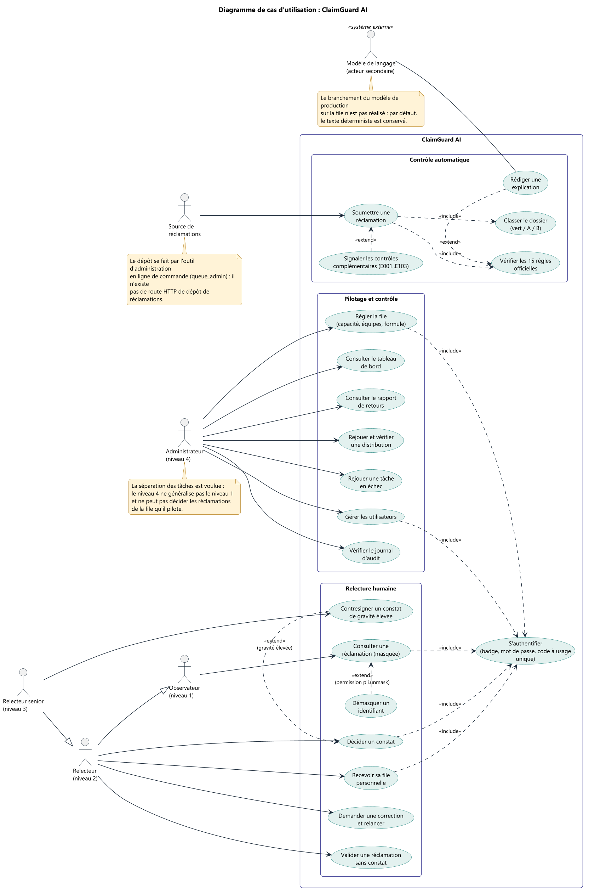

Les acteurs humains sont ordonnés par **généralisation** : le senior est un relecteur, qui est un observateur. L'administrateur est volontairement à part. Le modèle de langage est un **acteur secondaire** (système externe). « S'authentifier » est inclus (`include`) par les cas humains ; « Contresigner » **étend** (`extend`) « Décider un constat » sous la condition « gravité élevée » ; « Démasquer » étend « Consulter ».
*Choix à valider :* la granularité des cas, le choix de l'acteur secondaire pour l'IA, la généralisation entre niveaux.

#### 02. Classes du domaine métier

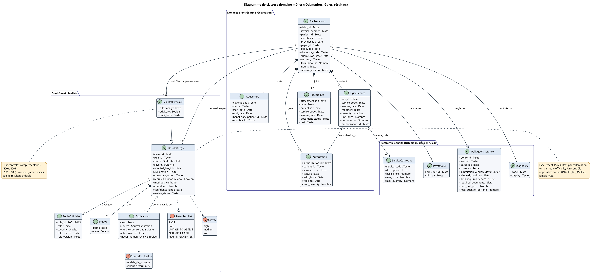

Une `Reclamation` **compose** ses lignes, sa couverture, ses autorisations et ses pièces jointes ; elle **référence** un prestataire, une police, un diagnostic. Elle est évaluée par exactement 15 `ResultatRegle`. `ResultatExtension` **spécialise** `ResultatRegle` (mêmes champs, plus la famille de règles et l'indicateur « consultatif »). Les énumérations portent les statuts, les gravités et la source de l'explication.
*Choix à valider :* types d'attributs (nous écrivons `Texte`, `Nombre` plutôt que des types de langage), usage de l'héritage pour les contrôles complémentaires.

#### 03. Classes de la file et de l'accès

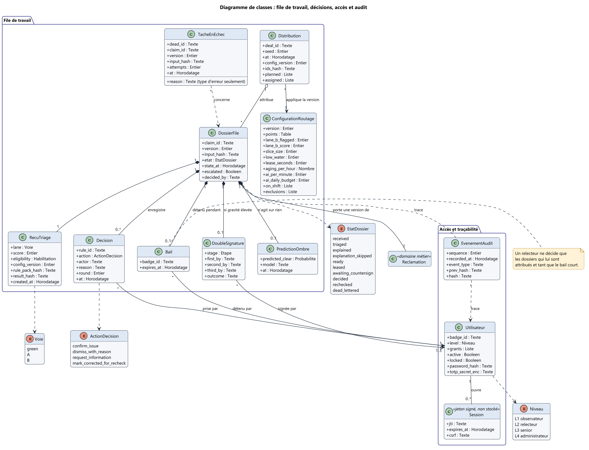

`DossierFile` porte une version de réclamation et **compose** son reçu de triage, son bail, ses décisions, sa double signature et sa prédiction « ombre ». `Session` est un jeton signé, non stocké (stéréotype indiqué). `EvenementAudit` forme une chaîne par hachage.
*Choix à valider :* représenter un document imbriqué par une composition (voir aussi le diagramme 12).

#### 04. Séquence : de la dépose à la décision

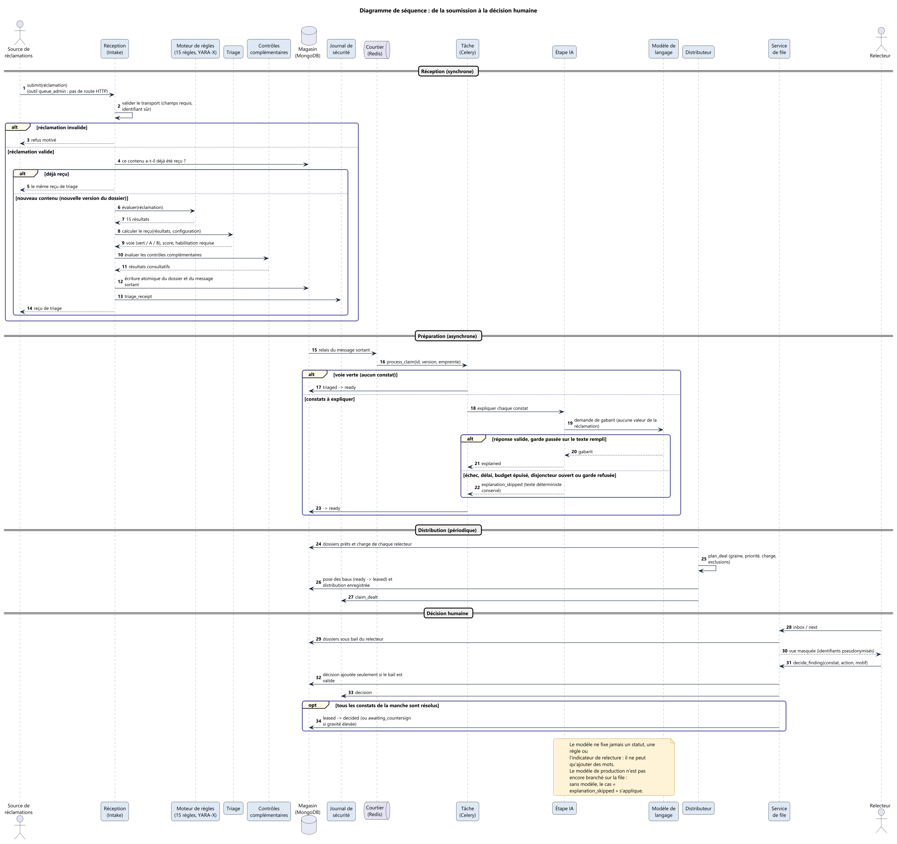

Cinq phases séparées par des filets : réception (synchrone), préparation (asynchrone), distribution (périodique), décision humaine. Les fragments `alt`/`opt` montrent les cas : réclamation invalide, contenu déjà reçu, voie verte, échec du modèle. Une note rappelle que le modèle de production n'est pas encore branché sur la file.
*Choix à valider :* un seul grand diagramme avec phases, ou un diagramme par phase ; notation des échanges asynchrones.

#### 05. Séquence : connexion et contrôle d'accès

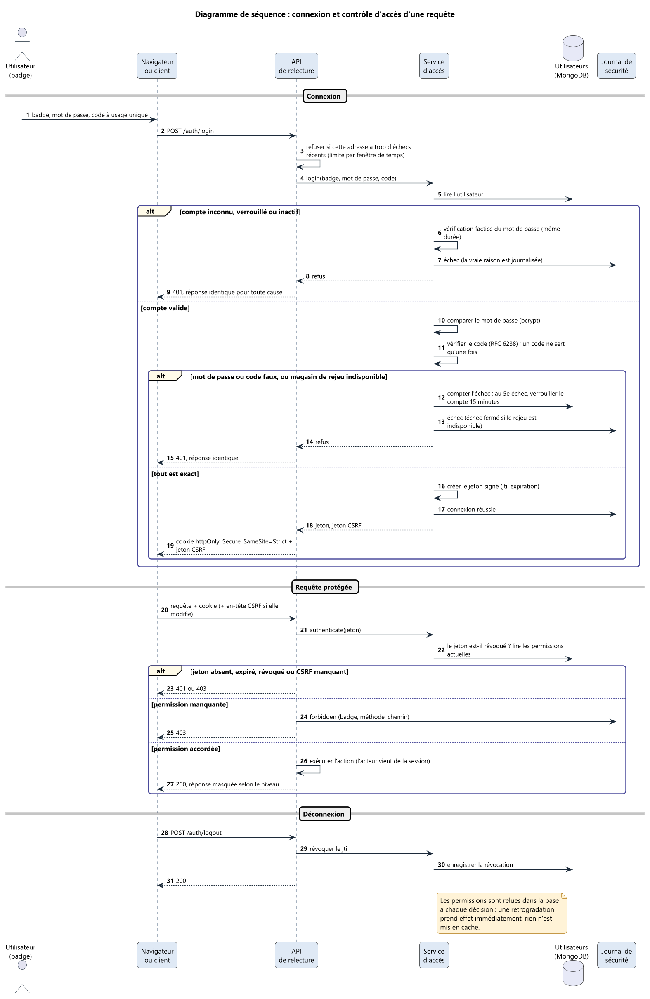

Connexion, requête protégée, déconnexion. Les échecs ont une réponse identique, le compte se verrouille au 5e échec, les permissions sont relues à chaque décision, la déconnexion révoque le jeton.

#### 06. Séquence : double signature

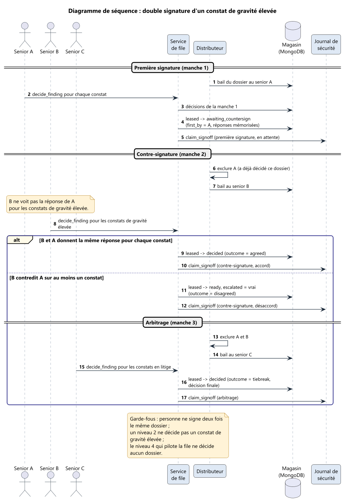

Trois seniors, trois manches. Le fragment `alt` sépare l'accord (dossier décidé) du désaccord (escalade puis arbitrage).

#### 07. Activité

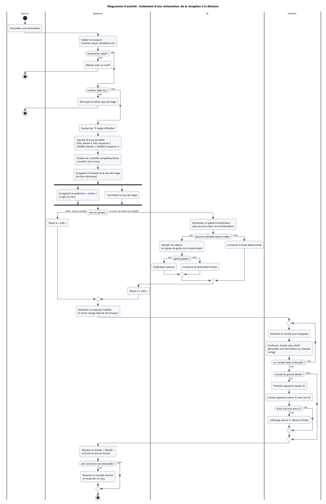

Quatre couloirs (Source, Système, IA, Humain), un **branchement parallèle** (`fork`) pour l'écriture de la prédiction « ombre » et du journal, des décisions imbriquées, une boucle de relecture et trois points d'arrêt.
*Choix à valider :* faut-il ajouter les flux d'objets (reçu, dossier) ?

#### 08. États-transitions

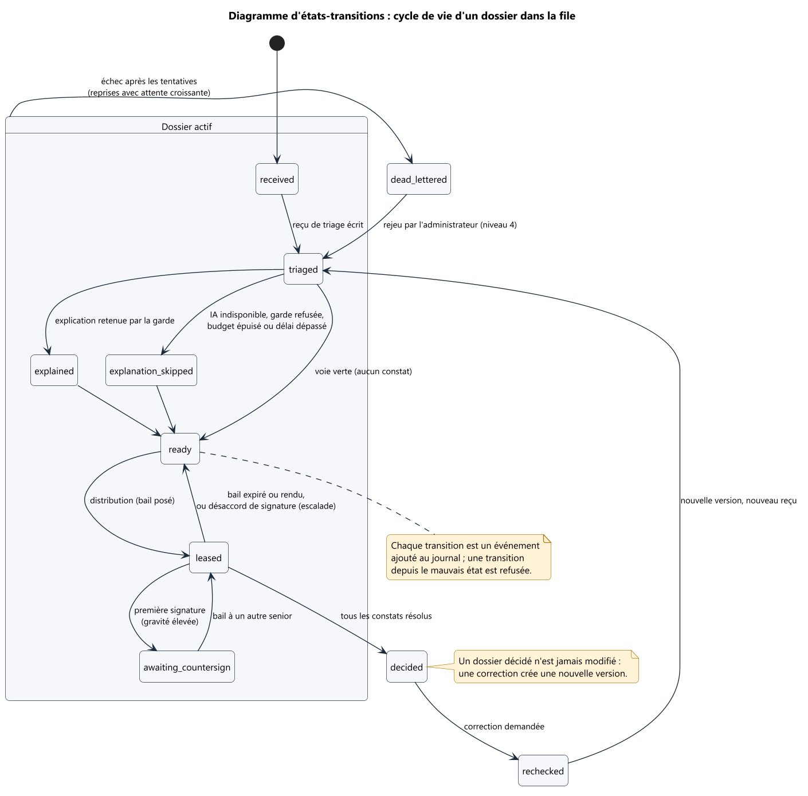

Dix états ; les 21 transitions de la table du code (`src/workqueue/states.py`) sont toutes représentées, celles vers `dead_lettered` étant regroupées par l'état composite « Dossier actif » (sinon sept flèches vers le même état).
*Choix à valider :* l'état composite ; une machine à états par version de dossier.

#### 09. Composants (vue d'ensemble)

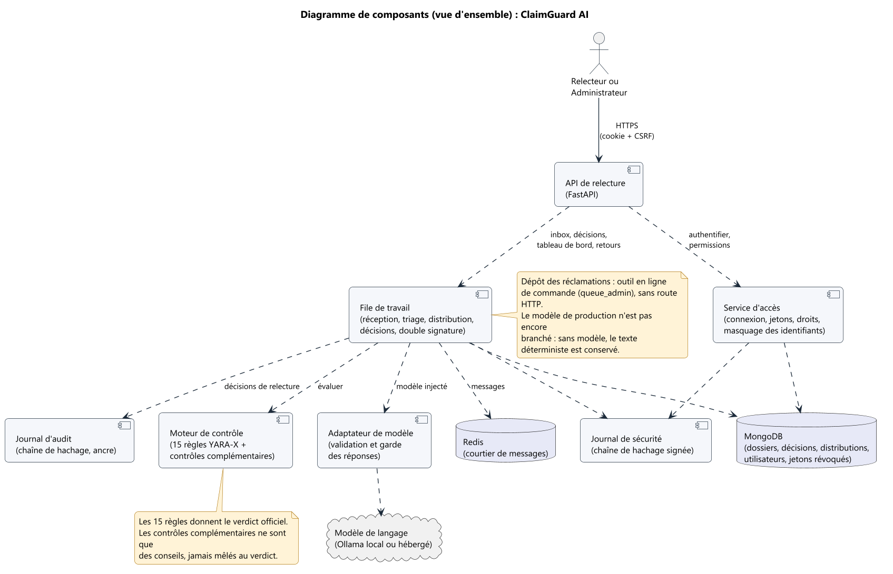

#### 09b. Composants (détail de la file)

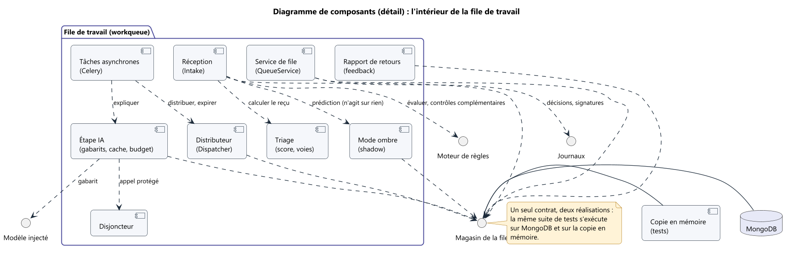

Deux niveaux d'abstraction, pour rester lisible. Le détail montre l'interface « Magasin de la file » réalisée deux fois (MongoDB et copie en mémoire).
*Choix à valider :* interfaces fournies et requises (notation « sucette » et « prise »).

#### 10. Déploiement

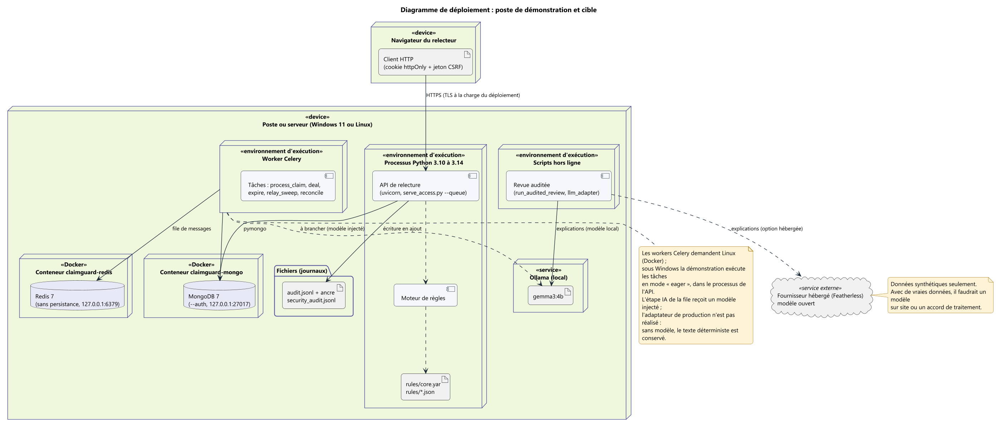

Poste (Windows ou Linux), processus Python (API de relecture et moteur), worker Celery, deux conteneurs Docker (MongoDB, Redis), modèle local (Ollama) et modèle hébergé. Sous Windows, les workers Celery ne tournent pas : la démonstration exécute les tâches en mode « eager » dans le processus de l'API.

#### 11. Paquetages

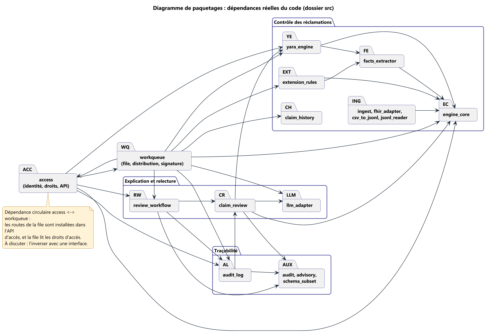

Les flèches viennent des importations réelles du code. On y voit une **dépendance circulaire** entre `access` et `workqueue` (les routes de la file sont installées dans l'API d'accès, et la file lit les droits d'accès). Nous la signalons plutôt que de la cacher.
*Choix à valider :* faut-il la supprimer par inversion de dépendance (une interface) ?

#### 12. Modèle de données NoSQL

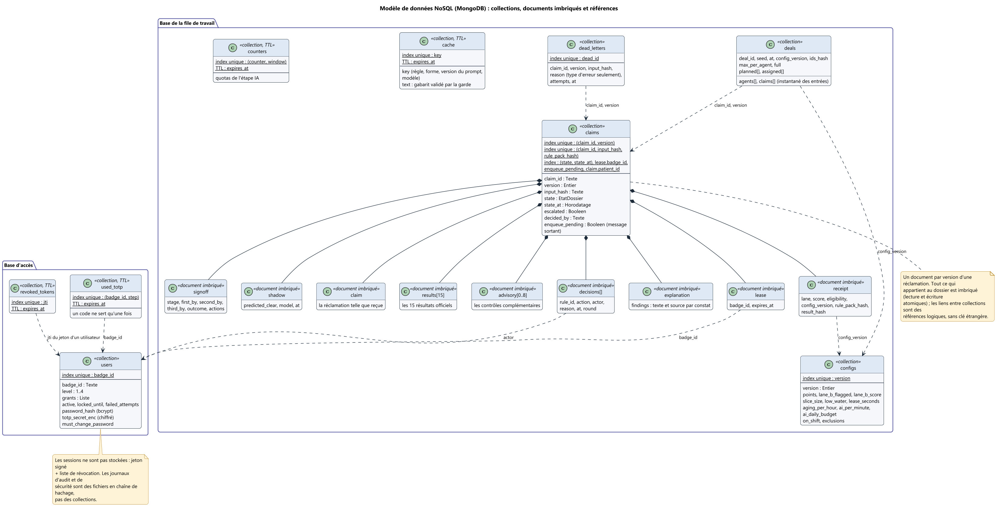

Neuf collections. La collection `claims` contient un document par **version** d'une réclamation et **imbrique** tout ce qui lui appartient (réclamation, résultats, reçu, décisions, bail, double signature). Les liens entre collections sont des références logiques, sans clé étrangère. Quatre collections ont une durée de vie (TTL) : `cache`, `counters`, `used_totp` et `revoked_tokens`.
*Choix à valider :* comment noter un document imbriqué en UML ; stéréotypes `«collection»` et `«document imbriqué»`.

### 6.3 Ce que nous n'avons pas dessiné, et pourquoi

| Diagramme | Raison | Question |
|---|---|---|
| Objets | Un exemple concret d'instances aiderait à expliquer le diagramme de classes | Utile pour la soutenance ? |
| Communication | Même information que la séquence, vue par les liens | Redondant ? |
| Temps | Peu de contraintes temporelles strictes (le bail de 30 minutes, les délais de l'IA) | Pertinent pour les baux ? |
| Structure composite | Le détail de la file est déjà donné en composants | Suffisant ? |
| Flux de données (hors UML) | `docs/22` en contient déjà un | À relier au dossier UML ? |

---

## 7. Questions pour l'enseignant d'UML

1. **Cas d'utilisation.** La généralisation entre niveaux d'habilitation est-elle une bonne façon de modéliser les rôles ? Le modèle de langage doit-il être un acteur secondaire ? La granularité (20 cas d'utilisation) est-elle adaptée ?
2. **Classes.** Faut-il un seul diagramme de classes ou, comme nous, un par domaine ? Comment représenter proprement un **document NoSQL** : composition, classe stéréotypée, ou diagramme dédié comme le nôtre ?
3. **Séquences.** Un grand diagramme avec des phases ou plusieurs petits ? Comment noter proprement l'asynchrone (tâche Celery) et une boucle périodique (le distributeur) ?
4. **États.** Un état composite est-il préférable à des transitions multiples vers un même état d'échec ? Doit-on modéliser les versions d'un dossier par une machine à états par version ?
5. **Activité.** Les couloirs Système/IA/Humain conviennent-ils ? Faut-il montrer les flux d'objets ?
6. **Composants et déploiement.** Quel niveau de détail attendez-vous ? Comment montrer un mode de démonstration qui diffère du déploiement cible (les workers en mode « eager » sous Windows) ?
7. **Paquetages.** Notre dépendance circulaire doit-elle être corrigée dans le code, ou documentée ? Quelle règle de dépendance recommandez-vous ?
8. **Complétude.** Quels diagrammes manquent pour un rendu « complet » : objets, communication, temps, structure composite ?
9. **Outils et format.** PlantUML est-il accepté ? Faut-il aussi un export XMI ou un PDF, ou un autre outil (StarUML, Visual Paradigm) ?
10. **Démarche.** Notre cahier des charges (exigences numérotées, priorités, statut, règles de gestion) suffit-il, ou faut-il une démarche précise (UP, 2TUP) et une matrice de traçabilité plus formelle ?

---

## 8. Traçabilité

| Exigence | Diagrammes | Preuve principale |
|---|---|---|
| EF-01, EF-02, EF-03 | 02, 04, 07, 09 | `docs/29`, tests d'ingestion et de règles |
| EF-04 | 02, 04 | `docs/30` |
| EF-05 | 02, 03, 04, 07 | `src/workqueue/triage.py`, tests de triage |
| EF-06 | 01, 04, 07, 09, 10 | `src/llm_adapter.py`, `src/workqueue/explain.py` ; **partiel** |
| EF-07, EF-16 | 03, 04, 09b, 12 | `src/workqueue/dispatcher.py`, `replay.py` |
| EF-08, EF-17 | 01, 03, 05, 12 | `SPECS.md` 10d |
| EF-09, EF-10, EF-12, EF-13 | 01, 04, 07 | `src/access/masking.py`, `src/review_workflow.py` |
| EF-11 | 06, 08 | `docs/31`, tests de double signature |
| EF-14, EF-15, EF-19 | 01, 09b | `queue.view`, `feedback.py`, `shadow.py` |
| EF-18 | 03, 09 | `src/audit_log.py` |
| ENF-06, ENF-08 | 05, 12 | `docs/32` |
| ENF-12 | 10 | `docker-compose.yml` |

---

## 9. Limites et points non réalisés

- **Pas d'écran web** : seule l'API de relecture existe (EF-20).
- **Pas de dépôt HTTP** : l'entrée des réclamations passe par l'outil `queue_admin` (EF-21).
- **Modèle de production non branché sur la file** : l'étape IA reçoit un modèle injecté ; sans modèle, le texte déterministe est conservé (EF-06 partiel). Le flux hors ligne, lui, utilise bien un modèle local ou hébergé.
- **Routage par confiance du modèle** : non retenu (EF-22).
- **Journal d'audit** : tamper-évident, pas inaltérable. Pas de stockage à écriture unique, pas d'horodatage externe (`docs/32`, partie 4).
- **Chiffrement au repos** : seuls le secret du second facteur (chiffré) et les mots de passe (hachés) sont protégés ; les réclamations et les preuves sont en clair dans la base (le masquage se fait à l'affichage).
- **Dépendance circulaire** `access` et `workqueue` (diagramme 11).
- **Mesures de l'IA** : les chiffres de latence viennent d'anciens appels enregistrés, non refaits.
- **Questions ouvertes du mentor** : un modèle entraîné peut-il intervenir dans la décision ? Une réclamation verte peut-elle ne pas passer par un humain ? Un modèle sur site de moins de 15 milliards de paramètres est-il obligatoire ?

---

## 10. Glossaire

| Terme | Sens |
|---|---|
| Réclamation (*claim*) | Demande de remboursement de soins, avec ses lignes, sa couverture et ses pièces |
| Règle | Contrôle déterministe sur une réclamation (R001 à R015 officielles ; E001 à E103 complémentaires) |
| Constat (*finding*) | Résultat `FAIL` ou `UNABLE_TO_ASSESS` d'une règle |
| Reçu de triage | Enregistrement du score, de la voie et de l'habilitation calculés à l'entrée |
| Voie (*lane*) | Verte, A ou B : classement par score |
| Bail (*lease*) | Attribution temporaire d'un dossier à un relecteur |
| Distribution (*deal*) | Un tirage du distributeur, avec sa graine, rejouable |
| Double signature (*sign-off*) | Deux seniors différents pour un constat de gravité élevée, plus un arbitre en cas de désaccord |
| Masquage | Remplacement des identifiants par des pseudonymes stables |
| Garde | Contrôle mécanique d'un texte produit par le modèle |
| Mode ombre (*shadow*) | Prédiction enregistrée d'un automate hypothétique, sans effet |
| TTL | Durée de vie d'un document dans MongoDB |

---

## 11. Régénérer les images

Les sources sont dans `docs/uml/`. Avec Java installé et le fichier `plantuml.jar` (publié sur Maven Central ; vérifier sa somme de contrôle SHA-1), depuis le dossier `docs/uml/` :

```
java -jar plantuml.jar -tpng -charset UTF-8 -o ../figures/uml *.puml
```

Les images de ce document ont été produites avec PlantUML 1.2026.8. Le fichier `style.iuml` fixe l'apparence commune.
