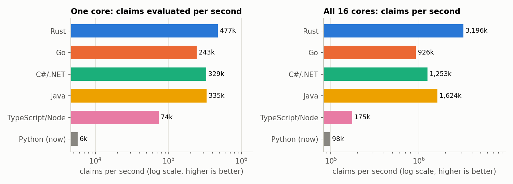
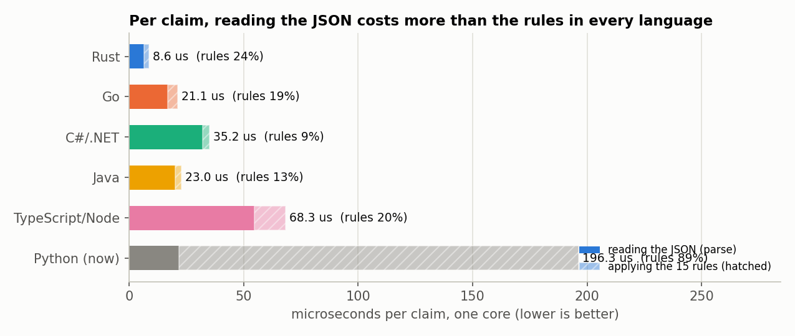
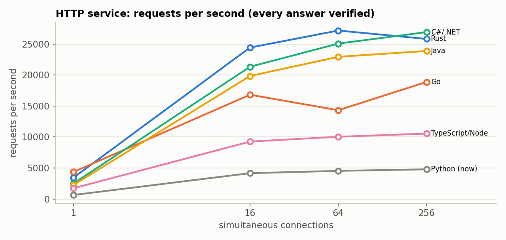
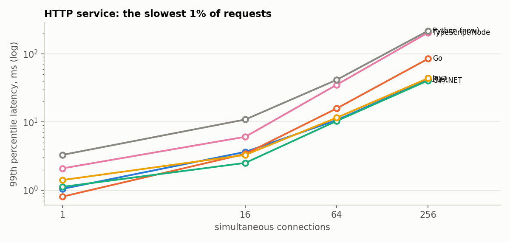
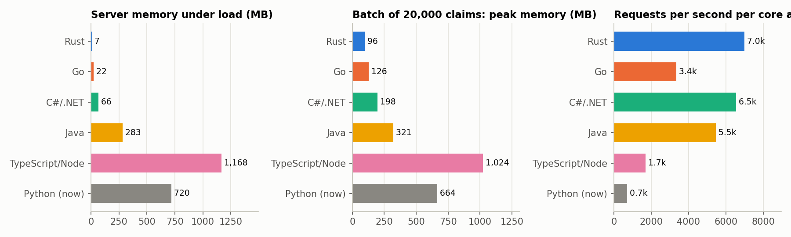
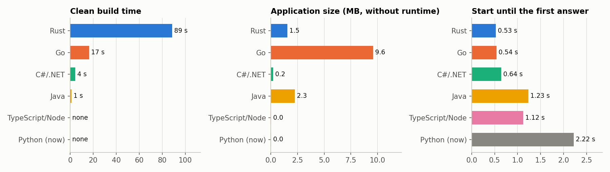
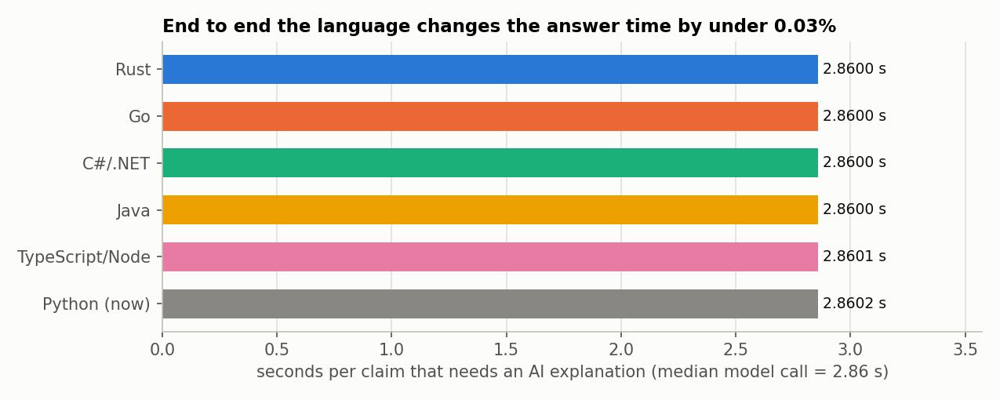
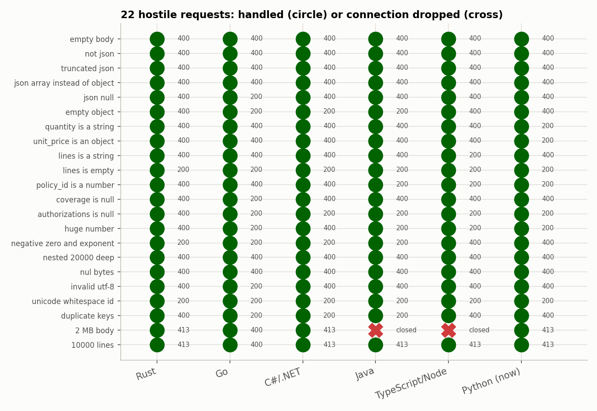
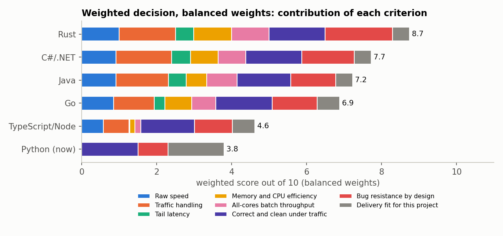
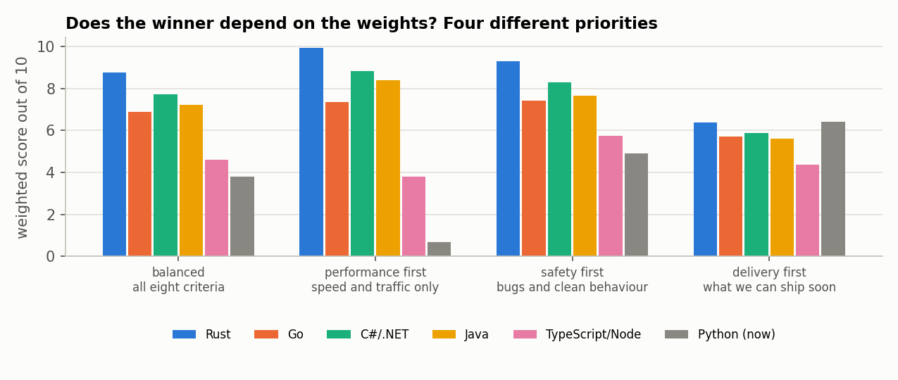

# Which programming language? Five candidates, measured

**Question (from the team):** pick five application languages that care about speed, efficiency, scalability, traffic handling and few bugs, and decide, with evidence, which one ClaimGuard should use.

**Short answer.**
1. **The rule engine is not where the time goes.** One claim costs about 4 to 20 microseconds of rules in the fast languages; one AI explanation costs a median 2.86 seconds. Whatever language we choose changes the time a reviewer waits for a claim by **less than 0.03%** (figure 8). So the language is a decision about cost, memory, safety and maintenance, not about how fast the product feels.
2. **If we move anything out of Python, move the rule engine and the intake API, and move it to Rust.** Rust won every profile that values performance or safety (balanced 8.7 of 10, performance-first 9.9, safety-first 9.3), used 7 MB where Java used 283 MB and Node 1,168 MB, and its design removes whole classes of bugs. C# (.NET) is a close second (7.7) and the best choice if we ever want a *full* rewrite by people who prefer a productive language. Go and Java trail on this workload; TypeScript and Python are 2 to 5 times slower under load.
3. **If the priority is shipping soon, keep Python.** Under "delivery first" weights Python ties with Rust (6.4) because everything already exists and has 1,795 tests behind it. A rewrite spends the days before the mentor meeting on code that does not change what a reviewer sees.

The recommendation is a *decision for the team* (section 8); nothing has been rewritten and nothing was pushed.

---

## 1. What was measured and how it was kept fair

**Workload.** The real thing: apply the 15 rulebook rules to a claim (`tests/oracle.py`, the independent reference that already reproduces the organizers' answer key on all 9,000 public results). The same **20,000 generated claims** (seed 20260927, `benchmarks/languages/gen_corpus.py`) go to every language, and the expected answer for each claim comes from the Python reference.

**Correctness first.** A port counts only if it reproduces the reference exactly. All six agree on **20,000 of 20,000 claims (0 mismatches)**, including exact decimal money arithmetic (cents, half-up rounding) and strict ISO date handling. Every HTTP answer during the load tests was also checked against the expected answer: **0 wrong answers in all runs**.

**Same shape in every language.** A typed parse of the claim JSON, then the 15 rules; the idiomatic exact-decimal type of each language (Go `shopspring/decimal`, Rust `rust_decimal`, C# `decimal`, Java `BigDecimal`, Node `decimal.js`); one HTTP endpoint with the same contract; the same load generator for all (a separate Go program, `loadgen/`).

| Language | Version | HTTP stack | Decimal type | Port size (lines of rules code) |
|---|---|---|---|---|
| Rust | rustc 1.99 (gnu target) | axum + tokio | rust_decimal | 590 |
| Go | 1.27.0 | net/http | shopspring/decimal | 618 |
| C# (.NET) | .NET 10.0.10 | ASP.NET Core (Kestrel) | decimal | 338 |
| Java | 27 | JDK built-in HttpServer, virtual threads | BigDecimal | 323 |
| TypeScript on Node | Node 24.13 | node:http + cluster | decimal.js | 242 |
| Python (control, what we run now) | 3.10.11 | FastAPI + uvicorn | Decimal | 316 |

**Machine.** One Windows 11 laptop: 16 logical CPUs, 15.7 GB RAM. The load generator and the server share it. This is the main limit of the whole study (section 7).

**Why these five.** All are widely used for application back ends, are compiled or JIT-compiled (so speed is a fair question), handle many connections at once, and differ on the bug question: Rust has no null and checks ownership at compile time; Go and Java and C# are memory safe with different null and concurrency stories; TypeScript adds types over a dynamic language. C and C++ were left out on purpose: they are fast but the "few bugs" requirement rules them out (memory-safety bugs are the leading source of serious vulnerabilities). Kotlin and Scala run on the JVM and would score like Java on speed.

## 2. Speed of the rules and of reading the JSON



Claims per second on one core and on all 16 cores, from the median of 5 runs of the 20,000-claim batch (each run internally repeats 7 times). Rust evaluates the rules for 20,000 claims in about **42 ms**, C# and Java in about 60 ms, Go in about 82 ms, Node in about 270 ms. Python took **1.4 s at best and up to 3.8 s** in the other runs: the same code swung by 2.5x between runs, which is itself a finding about this machine (section 7).



Reading the JSON costs more than applying the rules in every language. For a service, the parser matters as much as the rules, and the parser is a library choice, not a language feature. Rust parses 20,000 claims in about 130 ms, Go 340, Java 400, Python 430, C# 640 (including its start-up compilation), Node 1,090.

## 3. Traffic: an HTTP service under load

Throughput at 1, 16, 64 and 256 simultaneous connections, each pass 8 seconds after a 2-second warm-up. **Three passes in rotating order**, median reported, with the minimum and maximum kept.



| Language | 1 conn | 16 conn | 64 conn | 256 conn | p99 at 256 (ms) |
|---|---|---|---|---|---|
| Rust | 3,438 | 24,450 | 27,203 | 25,846 | 41.7 |
| C# (.NET) | 2,487 | 21,350 | 25,095 | 26,949 | 40.8 |
| Java | 2,256 | 19,860 | 22,957 | 23,900 | 43.9 |
| Go | 4,355 | 16,834 | 14,331 | 18,897 | 84.8 |
| TypeScript on Node | 1,722 | 9,265 | 10,048 | 10,559 | 205.5 |
| Python (FastAPI) | 644 | 4,162 | 4,539 | 4,786 | 218.4 |

(requests per second, median of three passes; the full table with min to max ranges is in `benchmarks/languages/results/summary.md`)



**What can be said with confidence.** Rust, C# and Java are in one group (about 20,000 to 27,000 requests per second); Go is lower but its three passes ranged from 14,000 to 39,000 at 256 connections; Node is about 2.5 times below the top group and Python about 5 to 6 times below, with the worst tail latency (p99 about 210 to 220 ms at 256 connections against about 41 ms). **What cannot be said:** the order *inside* the top group. The passes on this machine varied by a factor of two (Rust ranged from 25,000 to 61,000 at 256 connections), so Rust, C# and Java are statistically tied here.

**No errors and no wrong answers** in any language at any load once the two defects below were fixed.

## 4. Memory, CPU, build and start



At 64 connections the server held: Rust **7 MB**, Go 22 MB, C# 66 MB, Java 283 MB, Python 720 MB, Node **1,168 MB** (its cluster of worker processes, each with its own copy). Per core actually used, Rust and C# handled the most requests. On an on-premises server shared with MongoDB, Redis and the model, memory is a real cost.



Clean build: Rust 89 s, Go 17 s, C# 4 s, Java 1 s, Node and Python none. Start to first answer: Rust 0.53 s, Go 0.54 s, C# 0.64 s, Java 1.2 s, Node 1.1 s, Python 2.2 s. Rust and Go ship as a single file (1.5 MB and 9.6 MB); C#, Java and Node need their runtime installed on the server (or a larger self-contained package).

## 5. Where the time really goes (why the language barely matters for the product)



A claim that needs an AI explanation waits a median **2.86 s** for the model (p95 28.9 s, measured in `docs/27`). Adding even Python's slowest measured rule time (about 0.2 ms per claim) changes that by under 0.01%; the fastest language saves a few microseconds. This is Amdahl's law: speeding up a part that is a tiny fraction of the whole cannot speed up the whole. The language matters where there is *volume without a model call*: the intake API at 20,000 claims per second, the audit scan, and the server's memory bill.

## 6. Bugs: measured behaviour and design

**Measured: 22 hostile and malformed requests** per server (truncated JSON, a JSON array instead of an object, quantity as a string, `coverage: null`, a 400-digit number, 20,000-deep nesting, NUL bytes, invalid UTF-8, a 2 MB body, 10,000 lines, duplicate keys, Unicode whitespace): the server must answer and stay up. Status codes differ (a lenient server answers 200 where a strict one answers 400, for example Python on a string quantity); what is tested is that it never crashes, hangs or drops the connection.



**As first written, two of the ports failed this test**, which is the most useful result of the whole study:
* **Java:** a JSON `null` body and `coverage: null` threw a `NullPointerException` inside the handler and the JDK server **dropped the connection with no answer**.
* **C# (.NET):** `coverage: null` returned an **HTTP 500** from an unhandled null.
* **Java, again, under load:** with 256 keep-alive connections the JDK server's *default* limit of 200 idle connections closed connections, producing **2.2% errors** (6,471 of 283,000 requests). The fix is a setting, not code, and it is exactly the kind of default that bites in production.

Rust returned a clean 400 in all of these (a `null` where a struct is expected is a parse error, and there is no null to forget), as did Go and Python. After adding a catch-all and the setting, all servers pass; the first-pass numbers are kept in `results/results_first_pass.json`. Two servers (Java and Node) close the connection instead of answering when the body is larger than the 1 MB limit: safe, but unfriendly.

**By design (a judgement, with reasons in `benchmarks/languages/judged.json`):** Rust 9, C# 7, Go 6, Java 6, TypeScript 5, Python 4 out of 10. The reasoning: Rust has no null, checks ownership and data races at compile time, and forces `match` to be exhaustive; C# has nullable reference types but only as warnings; Go and Java are memory safe but allow nil/null panics and data races; TypeScript's types vanish at run time, so untrusted JSON is not protected by them; Python finds type mistakes only when the line runs (which is why this project built 1,795 tests, an oracle, fuzzing and mutation testing around it, and that effort counts for the project, not for the language).

## 7. Honest limits

* **One noisy machine.** HTTP throughput on this laptop varied up to 2x between passes (turbo and thermal behaviour, background processes, Windows Defender scanning new binaries, a shared load generator). Differences under about 2x between the top four languages are **not** established. A fair final measurement needs a quiet Linux server, the load generator on a second machine, and many repetitions. The scripts are ready for that (`run_bench.py`).
* **Windows, not Linux.** The target is on-premises Linux in Docker; Go, .NET and the JVM behave somewhat differently there.
* **The ports are mine, written for a benchmark.** Each follows the same structure and is idiomatic, but a specialist in any one language could tune it. Rust and Go were also compiled without profile-guided tuning; the JVM and .NET were measured after warm-up inside the batch runs and cold in the HTTP runs.
* **The weighted ranking contains two judged columns** (bug resistance by design, delivery fit). They are written down with reasons so they can be argued with; changing a number changes the ranking and the graphs (`make_report.py`).
* **Python's parallel numbers are processes, not threads** (the GIL), so its memory is counted per process.
* **No assessment of hiring, licensing or long-term support** beyond the delivery-fit judgement.

## 8. The decision



Eight criteria, each scored 0 to 10 (measured criteria on a log scale from the worst to the best language, so a 2x gap is not hidden): raw speed, traffic handling, tail latency, memory and CPU efficiency, all-cores batch throughput, correct and clean under hostile traffic, bug resistance by design, delivery fit for this project. Weights are a choice, so four different priorities were tried:



| Priority | Rust | C# | Java | Go | TypeScript | Python (now) |
|---|---|---|---|---|---|---|
| Balanced | **8.7** | 7.7 | 7.2 | 6.9 | 4.6 | 3.8 |
| Performance first | **9.9** | 8.8 | 8.4 | 7.3 | 3.8 | 0.7 |
| Safety first | **9.3** | 8.3 | 7.7 | 7.4 | 5.7 | 4.9 |
| Delivery first | **6.4** | 5.9 | 5.6 | 5.7 | 4.4 | **6.4** |

Rust is first in all four (tied with Python under delivery-first); C# is a stable second; TypeScript and Python are last on every priority except delivery. Only the "delivery first" row lets Python compete.

**Options for the team**

| Option | What it means | Cost | Gain |
|---|---|---|---|
| **A. Stay on Python, document this study** (recommended for the days before the mentor meeting) | Nothing changes in the product; docs/36 is the justification for "we measured and the AI step dominates" | none | Honest answer to "why Python?"; tested code stays |
| **B. Python for orchestration, Rust for the rule engine and intake API** (recommended direction after the meeting) | The 15 rules and the claim intake run as a small Rust service (YARA-X itself is written in Rust, so it can be used natively); the queue, console and API stay in Python and call it | the Rust port already exists and agrees on 20,000 claims; it needs the YARA-X rule pack, tests, a deployment image and an interface | about 30 times or more faster rules (best Python run 1.4 s against 42 ms per 20,000 claims), 7 MB instead of hundreds, no null or race bugs in the part that decides |
| **C. Full rewrite in C# (.NET)** | Everything moves; best productivity among the fast languages | weeks; all 1,795 tests rewritten | one fast, well-tooled platform |
| **D. Full rewrite in Rust or Go** | Everything moves | weeks, steepest learning curve (Rust) | smallest footprint |

**What would change this recommendation:** a measurement on a quiet Linux server that puts C# or Java clearly ahead of Rust; a mentor requirement for a single language across the system; a team that already knows C# or Go well; or load far beyond a claims-review office (for example millions of claims per day), which would make the engine's cost matter.

## 9. Reproduce

```
python benchmarks/languages/gen_corpus.py          # the 20,000 claims and their expected answers
python benchmarks/languages/run_bench.py           # builds all ports, runs batch and HTTP passes (about 40 minutes)
python benchmarks/languages/make_report.py         # figures in docs/figures/languages and results/summary.md
```
Raw results: `benchmarks/languages/results/results.json` (final), `results_single_pass.json` (one HTTP pass), `results_first_pass.json` (before the null and idle-connection fixes). The corpus files are generated, not committed.

## 10. Decision taken (2026-10-09)

The team chose **Rust for the whole system** (the "full rewrite" end of the options above), with 21 days to the deadline. Conditions agreed: **nothing on the Python side is deleted until the Rust code is finished**; the Python implementation, its 1,795 tests, the oracle and the recorded evidence stay in the repository as the reference the Rust version is checked against. One caution recorded for honesty: the measurements above show the language does not change the reviewer's waiting time (the AI step dominates); the reasons for Rust are memory, safety and speed of the parts that run without a model, not user-visible latency.
